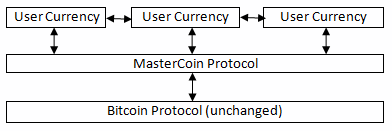
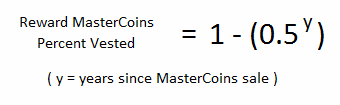
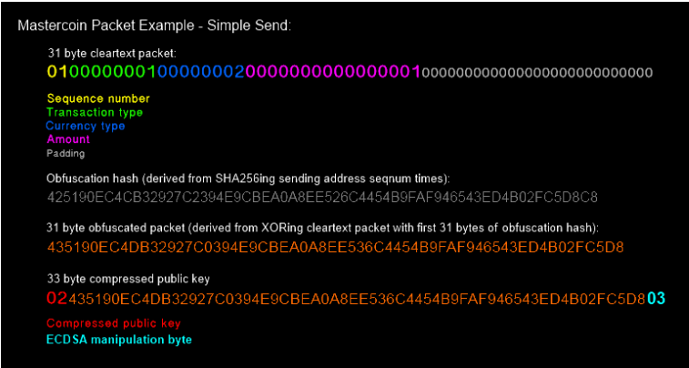

The Master Protocol / Mastercoin Complete Specification
=======================================================

Version 0.4.5.11 Smart Property Transaction 21 Edition

* JR Willett (https://github.com/dacoinminster and jr DOT willett AT gmail DOT com)
* Maran Hidskes (https://github.com/maran)
* David Johnston (https://github.com/DavidJohnstonCEO)
* Ron Gross (https://github.com/ripper234?source=c)
* Marv Schneider (https://github.com/marv-engine)

With input by Peter Todd (https://github.com/petertodd)

# Summary

We claim that the existing bitcoin network can be used as a protocol layer, on top of which new currency layers with new rules can be built without changing the foundation.  We further claim that the new protocol layers described in this document:

* Will fix the two biggest barriers to widespread bitcoin adoption: instability and insecurity.
* Will financially benefit the entire bitcoin user community, including those who don’t use the new protocol layers.
* Will provide initial funds to hire developers to build software which implements the new protocol layers, and ongoing funds to pay for maintenance of this software.
* Will richly reward early adopters of the new protocol, in proportion to how successful it is.


# Assumptions

Our claims are built on the following assumptions:

* Alternate block chains compete with bitcoins financially, confuse our message to the world, and dilute our efforts. These barriers interfere with the adoption momentum of bitcoin and the adoption momentum of alternate currencies as well, regardless of how well-conceived their rules may be.
* New protocol layers on top of the bitcoin protocol will increase bitcoin values, consolidate our message to the world, and concentrate our efforts, while still allowing individuals and groups to issue new currencies with experimental new rules. The success of any experimental currency protocol layer will enhance the value and success of the foundational bitcoin protocol. 
* Getting consensus and widespread adoption from the bitcoin community is not needed to add protocol layers, since no changes to the foundational bitcoin protocol are required. 
* Tiny bitcoin transactions can be encoded into the block chain to support and represent transactions in higher protocol layers. 
* A protocol can pay for its own software development, “bootstrapping” itself into existence, utilizing a trusted entity to hold funds and hire developers. 
* It is possible to create tools to allow end users to create currency protocol layers which have a stable value, pegged to an external currency or commodity. In this way, users of these currencies can own stabilized virtual currency tied to U.S. Dollars, Euros, ounces of gold, barrels of oil, etc. 
* It is possible for users of these new currencies to exchange between currencies with each other using simple rules and no central exchange.


# Visualization

The proposed protocol layers can be visualized as follows, with arrows representing users exchanging between currencies:

 


Note that all transfers of value are still stored in the normal bitcoin block chain, but higher layers of the protocol assign additional meaning to some transactions.

# Document History

1. Version 0.1 (previously 0.5) released 6 Jan 2012 (No packet definitions, overly-complicated currency stabilization)
1. Version 0.1.9 (previously 0.7) released 29 Jul 2013 (Preview of 0.2, but without revealing the Exodus Address)
1. Version 0.2 (previously 1.0) released 31 Jul 2013 (Version used during the fund-raiser)
1. Version 0.3 (previously 1.1) released 9 Sep 2013 (Smart Property + improvements for easier parsing & better escrow fund health)
1. Version 0.3.5 (previously 1.2) released 11 Nov 2013 (Added "Send To Owners" message, spending limits for savings wallets, contract-for-difference bets, and distributed e-commerce messages. Also added Zathras' new appendix (description of class B and class C methods of storing Mastercoin data).
1. Version 0.4 released 15 Feb 2014 (defined transaction message fields in a separate section, specified 5 transactions for initial deployment, added transaction version, New/Update/Cancel for sell offers, corrected dust threshold value) 
1. Version 0.4.5 released 20 Feb 2014 (added smart property crowdsale, other improvements to future features)
1. Version 0.4.5.1 released 3 Mar 2014 (clarified Sell MSC for Bitcoins behavior) 
1. Version 0.4.5.2 released 31 Mar 2014 (clarified details of smart property creation)
1. Version 0.4.5.3 released 3 Apr 2014 (corrected details of smart property administration)
1. Version 0.4.5.4 released 10 Apr 2014 (corrected/clarified invalid Simple Sends)
1. Version 0.4.5.5 released 15 Apr 2014 (clarified Number of coins field description)
1. Version 0.4.5.6 released 19 Apr 2014 (SP crowdsale funds not locked)
1. Version 0.4.5.7 released 2 May 2014 (lock down transaction decoding rules)
1. Version 0.4.5.8 released 8 May 2014 (adjust output value requirements)
1. Version 0.4.5.9 released 13 Jun 2014 (Transaction type 51 version 1 - accept multiple currencies, including bitcoins, in crowdsales)
1. Version 0.4.5.10 cleaned up "dividends" language to make sure it is clear there are lots of use cases for "send to owners", and that we don't encourage illegal behavior!
1. Version 0.4.5.11 released 8 Aug 2014 (completed tx21 description)

* Pre-github versions of this document (prior to version 0.3.5 / previously 1.2) can be found at https://sites.google.com/site/2ndbtcwpaper/

# Master Protocol / Mastercoin Terminology

* The term M.A.S.T.E.R. is an acronym for "Metadata Archival by Standard Transaction Embedding Records" 
* The term "Master Protocol" applies to the specification and the clients that implement its features.
* The term "MSC Protocol" is used as the abbreviation for "Master Protocol". 
* The term "Mastercoins" applies to the digital tokens that access the features of the "Master Protocol" clients.
* The term "MSC" is used as the abbreviation for "Mastercoins".

# Master Protocol Design

The “Master Protocol” layer between the existing Bitcoin Protocol and users’ currencies is intended to be a base upon which anyone can build their own currency. The software implementing the Master Protocol will contain simple tools which will allow anyone to design and release their own currency with their own rules without doing any software development.

## Initial Token Distribution via the “Exodus Address”

Perhaps you have heard of the “Genesis Block” which launched the Bitcoin protocol. The Master Protocol has a similar starting point in the block chain, called the “Exodus Address” - the bitcoin address from which the first Mastercoins were generated during the month of August 2013. The Exodus Address is: **[1EXoDusjGwvnjZUyKkxZ4UHEf77z6A5S4P](https://blockchain.info/address/1EXoDusjGwvnjZUyKkxZ4UHEf77z6A5S4P)**  

Initial distribution of Mastercoins was essentially a kickstarter style period to provide funding to pay developers to write the software which fully implements the protocol. The distribution was very simple, and proceeded as follows:

1. Anyone who sent bitcoins to the Exodus Address before August 31st, 2013 was recognized by the protocol as owning 100x that number of Mastercoins. For instance, if I sent 100 bitcoins to the Exodus Address before August 31st, my bitcoin address owns 10,000 Mastercoins after August 31st. 
2. Early buyers got additional Mastercoins. In order to encourage adoption momentum, buyers got an additional 10% bonus Mastercoins if they made their purchase a week before the deadline, 20% extra if they purchased two weeks early, and so on, including partial weeks. Thus, if I sent 100 bitcoins to the exodus address 1.5 weeks before August 31st, the protocol recognized my bitcoin address as owning 11,500 Mastercoins (10000 + 15% bonus).
3. Attempts to send funds to the Exodus Address on or after September 1st 2013 (after block #255365) were not considered Mastercoin purchases, and were refunded to the sender.

In the event that a purchase had multiple inputs, the input address contributing the most funds was recognized as owning the Mastercoins.

Note that anyone who purchased Mastercoins also received the same number of “Test Mastercoins” which are being used for testing new features before they are available for use in the Mastercoin protocol.

Initially, the only valid Mastercoin transaction was a “simple send” (defined later in this document), but the additional features described in this document are being implemented, and can be used once they are fully tested.

## Development Mastercoins (Dev MSC, previously "Reward Mastercoins")

1. Generation Rate: For every 10 Mastercoins sold during the Exodus period, 1 additional “Dev MSC” was also generated, which are being awarded to the Exodus Address slowly over the years following the exodus period (these Dev MSC are interoperable and fungible with regular MSC). These Development Mastercoins will ensure that developers have a continuing incentive to maintain, improve and add features to the Master Protocol implementations desired by users. The Distribution of these Dev MSC is structured so that developers receive 50% of the Dev MSC by one year after the initial Exodus Address period closed (date the Exodus Address closed - August 31st 2013, although transactions up till block 255365 were still accepted to account for slower propegation of transactions still sent on the 31st of August), 75% by a year later, 87.5% by a year later, and so on:

2. As dev MSC vest, 50% of them are sent out as bonuses to people who won Mastercoin bounties, in proportion to how much bounty money they won (bitcoins). The other 50% are used for expenses such as retention bonuses. Eventually, the Mastercoin Foundation will turn over all remaining funds to a distributed bounty system, with the Master Protocol paying its own bounties via a proof-of-stake voting system, and the Mastercoin Foundation will no longer need to administer any funds for the project.


Technical notes: 

* Any Mastercoin implementation implementing Exodus balance must recalculate the Development Mastercoin amount on each new block found and use the block timestamp for y.
* When calculating the years since the Mastercoin sale we assume a year is 31556926 seconds.
* 1377993874 is the Unix timestamp used to define the end-date of Exodus and thus the start date for the Development Mastercoins vesting.
* Current implementations do not have Test MSC which vest alongside dev MSC, but such coins may be recognized at some point in the future if it is deemed desireable 


## Embedding Master Protocol Data in the Block Chain

Bitcoin has some little-known advanced features (such as scripting) which many people imagine will enable it to perform fancy new tricks someday. The Master Protocol uses exactly NONE of those advanced features, because support for them is not guaranteed in the future, and the Master Protocol doesn't need them to embed data in the block chain.

The Master Protocol was originally specified to embed data in the block chain using fake bitcoin addresses (Class A), but we've since come up with a more blockchain friendly method which embeds data in a bitcoin multi-signature transaction (Class B). Once bitcoin miners start supporting the new OP_RETURN opcode as part of version 0.9 of the Bitcoin reference client, Master Protocol will be able to use that opcode to make the Master Protocol data completely prune-able (Class C) see description here by Gavin Andresen here: https://bitcoinfoundation.org/blog/?p=290 

Class C transactions are most preferred due to the Provably Prune-able Outputs avoiding issues of "bloat" and "pollution" of the block chain.

The technical details for both Class A and Class B transactions can be found in Appendix A.

## Special Considerations to Avoid Invalid Transactions

Not every bitcoin wallet lets you choose which address bitcoins come from when you make a payment, and Mastercoin transactions must all come from the address which holds the Mastercoins being used. If a bitcoin wallet contains bitcoins stored in multiple addresses, the user (or Master Protocol software) must first ensure that the address which is going to send the Mastercoin transaction has sufficient balance in bitcoins to create the transaction. Then, the Mastercoin-related transaction can be sent successfully from that address. 

Wallets which do not allow you to consolidate to one address and send from that address (such as online web wallet providers) will not work for Mastercoin unless they are modified to do so. For this reason, **attempting to purchase Mastercoins from an online web wallet will likely result in the permanent loss of those Mastercoins.**

Other than for these hosted wallets, a bitcoin address can also be treated as a Mastercoin address, capable of storing and using any Master Protocol currency.

## Best Practices for Handling Blockchain Reorganizations

Occasionally the bitcoin blockchain experiences a "reorg", when the current longest chain is replaced by another longer chain. Sometimes this results in recent transactions changing their order, or which transactions are included. 

The Master Protocol depends heavily on the order in which transactions appear in the blockchain. Even transactions in the same block can have different meaning or validity depending on the order in which they are recorded. Consequently, wallets and other blockchain parsers which also parse Master Protocol transactions need to detect these reorganizations and reparse the affected blocks, changing Master Protocol balances according to the the new ordering of transactions.

Initially, a reorganization could trigger a "naive" reparse, starting from the beginning and parsing all transactions in the history of the Master Protocol. Eventually, parsers should become more sophisticated and should keep checkpoints with all relevant Master Protocol Data written to disk at block milestones, so that they can start from the most recent unaffected checkpoint when a reorg event is detected.

The most important thing is that reorgs ARE detected. If an implementation does not contain code to react to reorgs, it could lose consensus with the other implementations, effectively forking the Master Protocol until the problem is noticed and the affected implementation is manually reset.

Also, in many cases a user may wish to do something with Mastercoins recently sent to them or otherwise affected by a recent transaction. Where possible, Mastercoin-aware wallets should re-use bitcoins from the previous transactions in subsequent transactions which are dependent on the earlier transactions. In this way, if the earlier transaction is invalidated (by a reorg), the dependent transaction will also be invalidated.

## Unlocking features

Not all features described in this document are active by default. Each feature will be unlocked on a certain block once it's deemed stable. Only Test Mastercoin transactions will be allowed if a feature is not unlocked yet. All other messages will be invalidated. The only exception to this rule is the Simple Send message, this has been enabled since Exodus.

+ Mastercoin/bitcoin distributed exchange features are unlocked as of block #290630
+ Smart property features are unlocked as of block #297110
+ Savings wallets and rate-limited wallets are unlocked as of block # (TBD)
+ Data feeds and simple betting are unlocked as of block # (TBD)
+ Contract-for-difference bets are unlocked as of block # (TBD)
+ Distributed e-commerce features are unlocked as of block # (TBD)
+ Escrow-backed currencies are unlocked as of block # (TBD)
+ Managed Token-pool Smart Property features are unlocked as of block (TBD) 

## Transaction versioning

Occasionally it seems prudent to change the format or interpretation of a Master Protocol message in order to improve the feature or fix a bug. To that end, each message has a version number. All Master Protocol implementations are expected to keep pace with changes of this nature, but in the event one falls behind, it must treat addresses which broadcast messages using version numbers it does not recognize as "black holes". That is, any funds or properties which enter the control of that address are considered lost and unspendable, since that address is using a newer version of the Master Protocol. In the event that the out-dated implementation is upgraded to recognize the new message formats, the blockchain can be re-parsed, and nothing will be lost.

This approach allows old versions of the Master Protocol to continue operating using the transactions they recognize without trying to parse messages of unknown meaning.

Generally, an out-dated parsing engine should either be upgraded to rejoin consensus, or retired by the owner. Implementations which are not in consensus can be used to attempt to defraud people

## Transaction Field Definitions

This section defines the fields that are used to construct transaction messages.

### Field: Currency identifier
+ Description: the currency used in the transaction
+ Size: 32-bit unsigned integer, 4 bytes
+ Inter-dependencies: [Ecosystem](#field-ecosystem)
+ Valid values: 
    * 1 and 3 to 2,147,483,647 in the real MSC ecosystem (2,147,483,646 unique values)
        * 1 = Mastercoin
    * 2 and 2,147,483,651 to 4,294,967,295 in the Test MSC ecosystem (Test MSC currencies and properties have the most significant bit set, values start with 0x80000003, yielding 2,147,483,646 unique values)
        * 2 = Test Mastercoin 

### Field: Ecosystem
+ Description: Specifies whether a smart property is traded against test MSC or real MSC
+ Size: 8-bit unsigned integer, 1 byte
+ Inter-dependencies: [Currency Identifier](#field-currency-identifier)
+ Valid values: 1 for MSC, 2 for Test MSC

### Field: Integer-eight byte
+ Description: used as a multiplier or in other calculations
+ Size: 64-bit unsigned integer, 8 bytes
+ Valid values: 0 to 9,223,372,036,854,775,807

### Field: Integer-four byte
+ Description: used as a multiplier or in other calculations
+ Size: 32-bit unsigned integer, 4 bytes
+ Valid values: 0 to 4,294,967,295

### Field: Integer-one byte
+ Description: used as a multiplier or in other calculations
+ Size: 8-bit unsigned integer, 1 byte
+ Valid values: 0 to 255

### Field: Integer-two byte
+ Description: used as a multiplier or in other calculations
+ Size: 16-bit unsigned integer, 2 bytes
+ Valid values: 0 to 65535

### Field: Listing identifier (future)
+ Description: the unique identifier assigned to each sale listing an a per address basis
+ Size: 32-bit unsigned integer, 4 bytes
+ Valid values: 0 to 4,294,967,295

### Field: Number of coins
+ Description: Specifies the number of coins or tokens affected by the transaction this field appears in, as follows:
    * for divisible coins or tokens, the value in this field is to be divided by 100,000,000 (e.g. 1 represents 0.00000001 MSC, 100,000,000 represents 1.0 MSC), which allows for the number of Master Protocol coins or tokens to be specified with the same precision as bitcoins (eight decimal places)
    * for indivisible coins or tokens, the value in this field is the integer number of Master Protocol coins or tokens (e.g. 1 represents 1 indivisible token)
+ Size: 64-bit signed integer, 8 bytes (same as Bitcoin Core)
+ Inter-dependencies: [Property type](#field-property-type)
+ Valid values: 1 to 9,223,372,036,854,775,807 which represents
    * 0.00000001 to 92,233,720,368.54775807 divisible coins or tokens
    * 1 to 9,223,372,036,854,775,807 indivisible coins or tokens

### Field: Property type
+ Description: Specifies if the Master Protocol coin or token to be created will be divisible or indivisible, and if that coin or token will replace or append an existing [Smart Property](#smart-property)
+ Size: 16-bit unsigned integer, 2 bytes
+ Inter-dependencies: [Number of coins](#field-number-of-coins)
+ Valid values:
    * 1: New Indivisible tokens
    * 2: New Divisible currency
    * 65: Indivisible tokens when replacing a previous property
    * 66: Divisible currency when replacing a previous property
    * 129: Indivisible tokens when appending a previous property
    * 130: Divisible currency when appending a previous property

### Field: Response sub-action (future)
+ Description: the seller's response to a buyer's offer to purchase
+ Size: 8-bit unsigned integer, 1 byte
+ Valid values:
    * 1: Accept
    * 2: Reject
    * 3: Contact

### Field: String 255 byte null-terminated
+ Description: a variable length string terminated with a \0 byte
+ Size: variable, up to 255 bytes, plus the null terminator
+ Valid values: Unicode encoded with UTF-8

### Field: Time period in blocks
+ Description: number of blocks during which an action can be performed
+ Size: 8-bit unsigned integer, 1 byte
+ Valid values: 1 to 255 

### Field: UTC Datetime
+ Description: Datetime, assuming UTC timezone (the same timezone used by the bitcoin blockchain)
+ Size: 64-bits standard unix timestamp, 8 bytes
+ Valid values: http://en.wikipedia.org/wiki/Unix_time, with precision to the second for computation and display, same as used by the Bitcoin protocol

### Field: Time period in seconds (future)
+ Description: number of seconds during which an action can be performed
+ Size: 32-bit unsigned integer, 4 bytes
+ Valid values: 1 to 31,536,000 (365.0 days)

### Field: Sell offer sub-action
+ Description: the specific action to be applied to the sell offer by this transaction
+ Size: 8-bit unsigned integer, 1 byte
+ Valid values:
    * 1: New
    * 2: Update
    * 3: Cancel

### Field: Transaction type
+ Description: the MSC Protocol function to be performed
+ Size: 16-bit unsigned integer, 2 bytes
+ Inter-dependencies: [Transaction version](#field-transaction-version)
+ Current Valid values:
    *    0: [Simple Send](#transfer-coins-simple-send)
    *    3: [Send To Owners](#send-to-owners)
    *   20: [Sell Coins for Bitcoins (currency trade offer)](#sell-mastercoins-for-bitcoins)
    *   21: [Offer/Accept Master Protocol Coins for Another Master Protocol Currency (currency trade offer)](#sell-master-protocol-coins-for-another-master-protocol-currency)
    *   22: [Purchase Coins with Bitcoins (accept currency trade offer)](#purchase-mastercoins-with-bitcoins)
    *   50: [Create a Property with fixed number of tokens](#new-property-creation-with-fixed-number-of-tokens)
    *   51: [Create a Property via Crowdsale with Variable number of Tokens](#new-property-creation-via-crowdsale-with-variable-number-of-tokens)
    *   52: [Promote a Property](#promote-a-property)
    *   53: [Close a Crowdsale Manually](#close-a-crowdsale-manually)
    *   54: [Create a Managed Property with Grants and Revocations](#new-property-with-managed-number-of-tokens)
    *   55: [Grant Property Tokens](#granting-tokens-for-a-managed-property)
    *   56: [Revoke Property Tokens](#revoking-tokens-for-a-managed-property)

+ To be added in future releases:
    *    2: [Restricted Send](#restricted-send)
    *   10: [Mark an Address as Savings](#marking-an-address-as-savings)
    *   11: [Mark a Savings Address as Compromised](#marking-a-savings-address-as-compromised)
    *   12: [Mark an Address as Rate-Limited](#marking-an-address-as-rate-limited)
    *   14: [Remove a Rate Limitation](#removing-a-rate-limitation)
    *   30: [Register a Data Stream](#registering-a-data-stream)
    *   31: [Publish Data](#publishing-data)
    *   40: [Offer/Accept a Bet](#offering-a-bet)
    *   60: [List Something for Sale](#listing-something-for-sale)
    *   61: [Initiate a Purchase from a Listing](#initiating-a-purchase)
    *   62: [Respond to a Buyer Offer](#accepting-a-buyer)
    *   63: [Release Funds and Leave Feedback](#leaving-feedback)
    * 100: [Create a New Child Currency](#new-currency-creation)

### Field: Transaction version
+ Description: the version of the transaction definition, monotonically increasing independently for each transaction type
+ Size: 16-bit unsigned integer, 2 bytes
+ Required/optional: Required
+ Inter-dependencies: [Transaction type](#field-transaction-type)
+ Valid values: 0 to 65535

# Transaction Definitions

Each transaction definition has its own version number to enable support for changes to each transaction definition. Up thru version 0.3.5 of this spec, the Transaction type field was a 4 byte integer. Since there were only 17 transactions identified, the upper 3 bytes of the field had a value of 0. For all spec versions starting with 0.4, the first field in each transaction message is the 2 byte version number, with an initial value of 0 and the Transaction type field is a 2 byte integer. So, each client must examine the first two bytes of the transaction message to determine how to parse the remainder of the message. If the value is 0, then the message is in the format specified in version 0.3.5 of this spec. If the value is at least 1, then the message is in the format associated with that version number.

Master Protocol transactions are not reversible except as explicitly indicated by this spec.

Any Mastercoin transaction from any address that attempts to transfer, reserve, commit coins, or put coins in escrow while that address's available balance for that currency identifier is 0 will be invalidated. 

## Transferring coins

Transfers are unconditional payments from one Mastercoin address to another address, set of addresses, or proportionally to owners of a specific property.

### Transfer Coins (Simple Send)

Description: Transaction type 0 transfers coins in the specified currency from the sending address to the reference address, defined in [Appendix A](#appendix-a-storing-mastercoin-data-in-the-blockchain). This transaction can not be used to transfer bitcoins.

In addition to the validity constraints on the message field datatypes, the transaction is invalid if any of the following conditions is true:
* the sending address has zero coins in its available balance for the specified currency identifier
* the amount to transfer exceeds the number owned and available by the sending address
* the specified currency identifier is non-existent
* the specified currency identifier is 0 (bitcoin)

A Simple Send to a non-existent address will destroy the coins in question, just like it would with bitcoin.

[Future: Note that if the transfer comes from an address which has been marked as “Savings”, there is a time window in which the transfer can be undone.]

Say you want to transfer 1 Mastercoin to another address. Only 16 bytes are needed. The data stored is:

| **Field** | **Type** | **Example** |
| ---- | ---- | ---- |
| Transaction version |[Transaction version](#field-transaction-version) | 0 |
| Transaction type | [Transaction type](#field-transaction-type) | 0 | 
|Currency identifier| [Currency identifier](#field-currency-identifier) |1 (Mastercoin)|
|Amount to transfer|[Number of Coins](#field-number-of-coins)|100,000,000 (1.0 coins) |

### Send To Owners

Description: Transaction type 3 transfers coins in the specified currency from the sending address to the current owners of that currency. The current owners are all the addresses, excluding the sender's address, that have a non-zero balance of the specified currency when the transaction message is processed. The Amount to transfer must be divided proportionally among the current owners based upon each owner's current available balance plus reserved amount, excluding the amount owned by the sender.

The sending address must be charged a transfer fee for each address that receives coins as a result of this transaction. The fee is:
* 0.00000001 Mastercoins for currencies in the MSC ecosystem, and 
* 0.00000001 Test Mastercoins for currencies in the Test MSC ecosystem.

See [Currency Identifier](#field-currency-identifier), above.

Be aware that some owners of the specified currency might receive zero coins due to rounding in calculating the number of coins for each owner. See the Implementation Note below.

This transaction can not be used to transfer bitcoins.

In addition to the validity constraints on the message field datatypes, the transaction is invalid if any of the following conditions is true:
* the sending address has zero coins in its available balance for the specified currency identifier
* the amount to transfer exceeds the number owned and available by the sending address
* the specified currency identifier is non-existent
* the specified currency identifier is 0 (bitcoin)
* the sending address does not have a sufficient available balance to pay the transfer fee
* the sending address owns all the coins of the specified currency identifier

Implementation Note: It is possible, even likely, that the number of coins calculated to be transferred to an owner's address will have to be rounded to comply with the precision for representing quantities of that coin. To reward the owners of the largest quantities and to try to ensure they receive full distributions, the following method must be used: compute the amount for the largest holder and, if necessary, round that amount up to the nearest unit that can be represented for the currency. Then subtract that rounded amount from the total to be distributed and repeat for the next largest holder until there are no more coins to be distributed. This means that holders of lesser amounts might receive zero coins from the distribution. When there are multiple owners with exactly the same number of coins, compute the distributions to those in alphabetical order by address.

Say you have grown wealthy and wish to gift all 1000 of your own Quantum Miner digital tokens to the other people holding those tokens. The message to do so will use 16 bytes:

1. [Transaction version](#field-transaction-version) = 0
1. [Transaction type](#field-transaction-type) = 3
2. [Currency identifier](#field-currency-identifier) = 6 for Quantum Miner Tokens
3. [Amount to transfer](#field-number-of-coins) = 100,000,000,000 (1000.00000000 Quantum Miner Tokens)

The protocol will split up the 1000 Quantum Miner tokens and send them to the other holders of those tokens, according to how many tokens they have. The sender will be charged a transfer fee based on the number of addresses that receive any of the 1000 Quantum Miner tokens.

Note to users: please make sure your proposed use case is legal in your jurisdiction!!

## Distributed Exchange

The Master Protocol allows users to trade coins without trusting a centralized website. When trading Mastercoins for bitcoins, this can be rather cumbersome, since it isn't possible to automatically match bids with asks, since we can't force the bidder to send bitcoins when a matching ask is found. When trading Mastercoins for other Master Protocol currencies, bids and asks are matched automatically.

Consequently, the messages below are different for mastercoin/bitcoin exchange than they are for exchange between mastercoin and other Master Protocol currencies, and the resulting UI must also be different, reflecting both the one-sided nature of bitcoin/mastercoin exchange as well as the additional anti-spam fees and race conditions inherent in the system.

### Sell Mastercoins for Bitcoins

Description: Transaction type 20 posts the terms of an offer to sell Mastercoins or Test Mastercoins for bitcoins. A new sell offer is created with Action = 1 (New). Valid currency identifier values for this transaction are 1 for MSC or 2 for Test MSC.

If the amount offered for sale exceeds the sending address's available balance (the amount not reserved, committed or in escrow), this indicates the user is offering to sell all coins that are available at the time this sell offer is published. The amount offered for sale, up to the amount available, must be reserved from the available balance for this address much like any other exchange platform. (For instance: If an address owns 100 MSC and it creates a "Sell Order" for at least 100 MSC, then the address's available balance is now 0 MSC, reserving 100 MSC.) After the sell offer is published, any coins received by the address are added to its then current available balance, and are not included in the amount for sale by this sell offer. The seller could update the sell offer to include these newly acquired coins, see [Change a Coin Sell Offer](#change-a-coin-sell-offer) below.

The unit price of the sell offer is computed from two of the fields in the transaction message: the "Amount for sale" divided by the "Amount of bitcoins desired". Once the unit price is computed, the "Amount of bitcoins desired" value can be discarded.

Note: An address cannot create a new Sell Mastercoins for Bitcoins offer while that address has *any* active offer that accepts Bitcoins. Currently, this includes an active Sell Mastercoins for Bitcoins offer (one that has not been canceled or fully accepted and full payment received) and an active [New Property Creation via Crowdsale with Variable number of Tokens](#new-property-creation-via-crowdsale-with-variable-number-of-tokens) that accepts Bitcoins.

Say you want to publish an offer to sell 1.5 Mastercoins for 1000 bitcoins. Doing this takes 34 bytes:

| **Field** | **Type** | **Example** |
| ---- | ---- | ---- |
| Transaction version |[Transaction version](#field-transaction-version) | 1 |
| Transaction type | [Transaction type](#field-transaction-type) | 20| 
|Currency identifier| [Currency identifier](#field-currency-identifier) |1 (Mastercoin) |
|Amount for sale|[Number of Coins](#field-number-of-coins)|150,000,000 (1.5 coins) |
|Amount of bitcoins desired|[Number of Coins](#field-number-of-coins)|100,000,000,000 (1000.0 coins) |
|Payment window|[Time Period in Blocks](#field-time-period-in-blocks) | 10  (10 blocks to send payment after counter-party accepts these terms)|
|Minimum bitcoin transaction fee|[Number of coins](#field-number-of-coins) | 10,000,000 (buyer must pay 0.1 BTC fee to the miner, discouraging fake offers)|
|Action|[Sell Offer sub-action](#field-sell-offer-sub-action) | 1 (New offer)|

Note that some trading of Test MSC was done with version 0 of this message which did not have the Action field. Those transactions are treated as Action=3 (Cancel offer) when the Amount for sale is zero. For version 0 of this message and Amount for sale = 0 (Cancel offer), the values in the following fields are not tested for validity:
* Amount of bitcoins desired
* Time limit in blocks
* Minimum bitcoin transaction fee

For version 0 of this message and Amount for sale is non-zero, it is treated as Action=1 (New offer) unless there is already an offer outstanding from this address for the same Currency identifier, in which case it is treated as Action = 2 (Update offer).

#### Change a Coin Sell Offer

An offer to sell coins can be changed by using Action = 2 (Update) until either: there are valid corresponding purchase offers (transaction type 22) for the whole amount offered, or the sell offer is canceled. The Currency identifier cannot be changed.

The change will apply to the balance that has not yet been accepted with a purchase offer. The stored unit price must be updated using the updated Amount for sale and Amount of bitcoins desired. The Amount desired value can be discarded after the unit price is updated. The UI must indicate if the update was successful and how many coins were purchased before the update took effect.

The amount reserved from the available balance for this address will be adjusted to reflect the new amount for sale. Note that the amount reserved as a result of the update is based on the available balance at the time of the update plus the existing sell offer amount not yet accepted at the time of the update.

Say you decide you want to change an offer, e.g. the number of coins you are offering for sale, or change the asking price. Send the transaction with the new values and the values that are not changing and Action = 2 (Update) before the whole amount offered has been accepted. Note that while the portion of an offer which has been accepted cannot be changed, sending an update message still has an effect, in that it affects any coins which have not been accepted, and it affects accepted coins if the buyer fails to send payment. 

#### Cancel a Coin Sell Offer

A currency sell offer can be canceled by using Action = 3 (Cancel) until the offer has been fully accepted by valid purchase offers ([Purchase Mastercoins with Bitcoins](#purchase-mastercoins-with-bitcoins)). When a sell offer is canceled, the associated coins are no longer reserved.

When canceling a sell offer, the values in the following fields are not tested for validity:
* Amount for sale
* Amount of bitcoins desired
* Time limit in blocks
* Minimum bitcoin transaction fee

The cancel will apply to the amount that has not yet been accepted. The UI must indicate if the cancellation was successful and how many coins were not sold.

If you want to cancel an offer, use Action = 3 (Cancel) and send the transaction before the full amount for sale has been accepted. Note that while the portion of an offer which has been accepted cannot be canceled, sending the cancel message still has an effect, in that it cancels any portion of the offer which has not been accepted, and it prevents accepted coins from being relisted if the buyer fails to send payment. 

### Purchase Mastercoins with Bitcoins

Description: Transaction type 22 posts acceptance of an offer to sell Mastercoins for bitcoins. All or some of the coins offered can be purchased with this transaction.

The reference address must point to the seller's address, to identify whose offer you are accepting. The purchaser’s address must be different than the seller’s address.

If you send an offer for more coins than are available at the time your transaction gets added to a block, your amount bought will be automatically adjusted to the amount still available. When a Purchase Offer is sent to an address that does not have a matching active Sell Offer, e.g. the Sell offer has been canceled or is all sold out, the Purchase Offer must be invalidated. It is not valid to send a Purchase Offer to an address if the sending address has an active Purchase Offer (not fully paid for and time limit not yet reached) with that address.

Note: Your total expenditure on bitcoin transaction fees while accepting the purchase must meet the minimum fee specified in the Sell Offer in order for the transaction to be valid.

You must send the appropriate amount of bitcoins before the time limit expires to complete the purchase. Note that you must send the bitcoins from the same address which initiated the purchase. If you send less than the correct amount of bitcoins, your purchase will be adjusted downwards once the time limit expires. The remaining coins will be added back to those available in the Sell Offer if it’s still active. If you send more than the correct amount of bitcoins, your bitcoins will be lost (unless the seller chooses to return them to you). If you do not send complete payment before the time limit expires, the unpurchased coins will be added back to those available in the Sell Offer if it’s still active.

Please note that the buyer is allowed to send multiple bitcoin payments between the Purchase Offer and expiration block which are accumulated and used to adjust the Purchase Offer accordingly. The buyer's Mastercoin available balance is credited with the purchased coins when each bitcoin payment is processed.

In order to make parsing Master Protocol transactions easier, you must also include an output to the Exodus Address when sending the bitcoins to complete a purchase of Mastercoins. The output can be for any amount, but should be at least as high as the amount which is considered as dust threshold by a majority of Bitcoin nodes so that propagation of the transaction within the network and confirmation by a miner is not delayed.

Other Master Protocol messages (for instance if the buyer wants to change his offer) are not counted towards the actual purchase, even though bitcoins are sent to the selling address as part of encoding the messages. 

Say you see an offer such as the one listed above, and wish to initiate a purchase of those coins. Doing so takes 16 bytes:

| **Field** | **Type** | **Example** |
| ---- | ---- | ---- |
| Transaction version |[Transaction version](#field-transaction-version) | 0 |
| Transaction type | [Transaction type](#field-transaction-type) | 22| 
|Currency identifier| [Currency identifier](#field-currency-identifier) |1 (Mastercoin) |
|Amount to be purchased|[Number of Coins](#field-number-of-coins)|130,000,000 (1.3 coins) |

### Sell Master Protocol Coins for Another Master Protocol Currency

Description: Transaction type 21 is used to both publish and accept an offer to sell coins in one Master Protocol Currency for coins in another Master Protocol Currency.

If the amount offered for sale exceeds the sending address's available balance (the amount not reserved, committed or in escrow), this indicates the user is offering to sell all coins that are available at the time this sell order is published. The amount offered for sale, up to the amount available, must be reserved from the available balance for this address much like any other exchange platform. (For instance: If an address owns 100 MSC and it creates a "Sell Order" for at least 100 MSC, then the address's available balance is now 0 MSC, reserving 100 MSC.) After the sell order is published, any coins received by the address are added to its then current available balance, and are not included in the amount for sale by this sell order. The seller could update the sell order to include these newly acquired coins, see [Change a Transaction Type 21 Coin Sell Order](#change-a-transaction-type-21-coin-sell-order) below.

The new sell order's unit price is computed from two of the fields in the transaction message: the "Amount desired" divided by the "Amount for sale". An existing order's original unit price is used to match against new orders. The unit price does not change except by using the Change action. See below.

An address cannot create a new sell order while that address has an active sell order with the same currencies in the same roles (for sale, desired). An active sell order is one that has not been canceled or fully accepted. The currency id for sale must be different from the currency id desired. Both currency id's must refer to existing currencies.

To accept an existing sell order, an address simply publishes the same message type with an inverse offer (e.g. selling Goldcoins for Mastercoins in the example below) at a unit price which is greater than or equal to the existing sell order's unit price. The protocol then finds existing sell orders that qualify (match), possibly including existing sell orders from that same address.

A liquidity bonus for the owners of existing sell orders provides an incentive for people to put their coins up for sale at a price which does not get filled instantly, increasing available liquidity on the exchange. The liquidity bonus for the owner of a matching sell order is taken from the amount paid by the new sell order. The liquidity bonus is 0.3% of the amount paid by the new sell order, rounded to the nearest .00000001 for divisible tokens or to the nearest whole number for indivisible tokens. The liquidity bonus percentage and/or calculation may change in the future.

The following table shows examples of the liquidity bonus based on the new order's amount for sale and the existing order's minimum amount desired, for *divisible* coins. This table does not show the new order's minimum amount desired or the existing order's amount for sale, which are not subject to the liquidity bonus.

|**New Order Amt for Sale**|**Existing Order Min Amt Desired**|**Amt Transferred**|**Liquidity Bonus Paid**| **New Order Remainder for Sale** | **Existing Order Remainder Desired** |
|---:|---:|:---|---:|---:|:---|
| 100.3 | 100.0 | 100.0 | 0.3 | 0.0 | 0.0 |
| 100.0 | 100.0 | 99.70089731 | 0.29910269 | 0.0 | 0.29910269 |
| 125.0 | 100.0 | 100.0 | 0.30 | 24.7 | 0.0 |
| 50.0 | 100.0 | 49.85044865 | 0.14955135 | 0.0 | 50.14955135 |

The following table shows examples of the liquidity bonus based on the new order's amount for sale and the existing order's minimum amount desired, for *indivisible* coins. This table does not show the new order's minimum amount desired or the existing order's amount for sale, which are not subject to the liquidity bonus.

|**New Order Amt for Sale**|**Existing Order Min Amt Desired**|**Amt Transferred**|**Liquidity Bonus Paid**| **New Order Remainder for Sale** | **Existing Order Remainder Desired** |
|---:|---:|---:|---:|---:|---:|
| 1003 | 1000 | 1000 | 3 | 0 | 0 |
| 1000 | 1000 | 997 | 3 | 0 | 3 |
| 502 | 502 | 500 | 2 | 0 | 2 |
| 500 | 1000 | 499 | 1 | 0 | 501 |
| 500 | 500 | 499 | 1 | 0 | 1 |
| 100 | 100 | 100 | 0 | 0 | 0 |
| 125 | 100 | 100 | 0 | 25 | 0 |

The coins from each matching order and the new order are exchanged between the corresponding addresses at the unit price specified by the matching order plus the liquidity bonus amount until the full amount for sale in the new order is transferred to the address of the matching sell order or there are no more matching orders. Note: Indivisible coins are transferred in whole units only, rounded down, see [Smart Property](#smart-property) below. This can cause the effective unit price to be higher than the matching sell order's specified unit price, but still never greater than the reciprocal of the new sell order's unit price. 

It is valid for the purchaser’s address to be the same as the seller’s address.

An existing order matches the new order when all of the following conditions are met: 

1. the existing order's Currency id for sale is the same as the new order's Currency id desired
1. the existing order's Currency id desired is the same as the new order's Currency id for sale
1. the existing order's unit price is less than or equal to the reciprocal of the new order's unit price
1. the existing order is still open (not completely sold or canceled)

Existing orders that match are sorted as follows to be applied to the new order:

1. by unit price, ascending (best price for the new order first)
1. then by transaction block number, ascending chronological order (oldest first)
1. then by transaction position within the block, ascending order (oldest first)

If there are no matches for the new sell order or the aggregate amount desired in the matching orders is less than the amount for sale in the new sell order, the new sell order must be added to the list of existing sell orders, with the remaining amount for sale at the original unit price. This order is now a candidate for matching against future sell orders. Note that when only some coins from an existing order are purchased, the remaining coins from that order are still for sale at the original unit price.

Say you want to publish an offer to sell 2.5 Mastercoins for 50 GoldCoins (coins which each represent one ounce of gold, derived from Mastercoins and described later in this document). For the sake of example, we'll assume that GoldCoins have currency identifier 3. Doing this takes 29 bytes:

| **Field** | **Type** | **Example** |
| ---- | ---- | ---- |
| Transaction version |[Transaction version](#field-transaction-version) | 0 |
| Transaction type | [Transaction type](#field-transaction-type) | 21| 
|Currency identifier for sale| [Currency identifier](#field-currency-identifier) |1 for Mastercoin|
|Amount for sale|[Number of Coins](#field-number-of-coins)|250,000,000 (2.5 coins) |
|Currency identifier desired| [Currency identifier](#field-currency-identifier) |3 for GoldCoin |
|Amount desired|[Number of Coins](#field-number-of-coins)|5,000,000,000 (50.0 coins) |
| Action | [Sell Offer sub-action](#field-sell-offer-sub-action) | 1 (New offer) | 

Initially the UI should require that either the currency id for sale or the currency id desired be Mastercoins (or Test Mastercoins), since those currencies are the universal token of the protocol and the only ones which can be traded for bitcoins (and thus exit the Mastercoin ecosystem). This restriction is at the UI level and can be removed if the Mastercoin community (Mastercoin holders) votes to change it.

#### Change a Transaction Type 21 Coin Sell Order

An offer to sell coins can be changed by using Action = 2 (Update) until the whole Amount for sale has been sold or the offer is canceled. An Update is equivalent to a [Cancel a Transaction Type 21 Coin Sell Order](#cancel-a-transaction-type-21-coin-sell-order) followed by a new Transaction Type 21 Coin Sell Order.

The Amount for sale and the Amount desired are the two fields that can be updated. Neither of these fields can have a value of zero. Attempts to change the Currency identifier for sale or the Currency identifier desired must invalidate the update transaction. Attempts to update a sell order that is not active for any reason must be invalidated. A  valid transaction type 21 with Action=2 updates the existing sell order, including block number and position within the block, and then performs the same matching process as for a transaction type 21 with Action=1 (New).

The amount reserved from the available balance for this address must be adjusted to reflect the new amount for sale. Note that the amount for sale as a result of the update is limited by the available balance at the time of the update plus the existing sell order amount not yet matched at the time of the update.

The UI must indicate if the update was successful and how many coins were purchased before the update took effect.

Say you decide you want to change a sell order, e.g. the number of coins you are offering for sale, or the number of coins desired. Send the transaction with the new value(s), the same currency identifiers and Action = 2 (Update) so it is processed before the whole amount for sale has been matched. Note that while the portion of a sell order which has been matched and sold cannot be changed, sending an update message affects any coins which have not been matched. 

#### Cancel a Transaction Type 21 Coin Sell Order

An offer to sell coins can be canceled by using Action = 3 (Cancel) before the order has been fully matched. When a sell order is canceled, the associated coins are no longer reserved. Attempts to cancel a sell order that is not active for any reason must be invalidated.

When canceling a sell order, the values in the following fields are not tested for validity:
* Amount for sale
* Amount desired

The cancel will apply to the remaining Amount for sale. The UI must indicate if the cancellation was successful and how many coins were not sold.

If you want to cancel a sell order, specify the same currency identifiers and Action = 3 (Cancel) and send the transaction so it is processed before the full amount for sale has been matched. Note that while the portion of a sell order which has been matched and sold cannot be canceled, sending the cancel message cancels any portion of the order which has not been matched.

## Smart Property

The Master Protocol supports the creation of property tokens to be used for titles, deeds, user-backed currencies, and even investments in a company. Property tokens can be bought, sold, transferred, and used for betting, just as Master Protocol currencies are.

Properties are awarded currency identifiers in the order in which they are created. Mastercoin is currency identifier 1 (bitcoin is 0), and Test Mastercoins have currency identifier 2. Additional properties and currencies therefore start at ID #3. Properties issued and traded using real MSC are kept completely distinct from those issued and traded using Test MSC, so the ID numbering systems for the two [ecosystems](#field-ecosystem) are independent. Test Mastercoin properties have the most significant bit set to distinguish them from real properties, and they cannot be traded against real Mastercoins nor otherwise interact with non-test properties. Test MSC property IDs  also start numbering from 3, but with the most significant bit set. In sandbox environments using only Test MSC, these IDs can be displayed without the MSB set, for easier reading.

Every property has a [Property type](#field-property-type), which defines whether it is divisible or not and whether the property replaces or appends a previous property. To create 1,000,000 units of a divisible currency, choose property type 2 and specify 100,000,000,000,000 for the number of properties (1 million divisible to 8 decimal places). For 1,000,000 indivisible tokens for a company, choose property type 1 and specify 1,000,000 for the number of properties. The difference between divisible and indivisible property types is how they are displayed (i.e. where the decimal point goes) and the range of valid values that can be specified in a transaction message field (see [Number of coins](#field-number-of-coins)). 

The attributes of an existing property cannot be changed. However, a new property can be created to replace or append an existing property. Only the address that issued a property can replace or append that property. Attempts by other addresses are invalid. A replaced property can still be used and traded as normal, but the UI should indicate to the user that a newer version of the property exists and link to it.  To indicate that the issuer is abandoning a property entirely:
* set Previous Property ID to that property's id,
* set Number Properties to zero, and
* use one of the "replace" values for [Property Type](#field-property-type) (see Transaction types [50](#new-property-creation-with-fixed-number-of-tokens) and [51](#new-property-creation-via-crowdsale-with-variable-number-of-tokens), below). 

A property can be replaced and appended multiple times, even abandoning and un-abandoning it more than once. Appended properties must not be treated as the same asset in the UI or protocol parsers (the appended properties have independent values). When displaying a property, the UI should provide links to any related properties. Related properties are the property which was replaced or appended by this property (if there is one) as well as any properties from the same issuer which replace or append this property.
 
The Ecosystem for the property must be the same as the ecosystem for the "Currency identifier desired", i.e. both must be in the Mastercoin ecosystem or both must be in the Test Mastercoin ecosystem.

Any time the name of a property is displayed, the ID number of the property must also be displayed with it in the format "NAME (ID)", to avoid name collisions. For instance, "Quantum Miner (8)". This is very important to prevent a malicious user from creating a property to impersonate another property.

To help distinguish legitimate companies and ventures from scams, spam, and experiments, the Master Protocol allows users to spend Mastercoins for the purpose of promoting a smart property. When UI clients display smart properties, the default ordering should be based on how many Mastercoins have been spent for promoting the property, adjusted for how long ago the Mastercoins were spent. Details on promoting a smart property by spending Mastercoins and how that affects sort ordering can be found below.  

The "Property Data" field is general-purpose text, but can be used for things like storing the hash of a contract to ensure it is in the block-chain at property creation (i.e. "Proof of Existence").

### New Property Creation with Fixed number of Tokens

Description: Transaction type 50 is used to create a new Smart Property with a fixed number of tokens.

If creating a title to a house or deed to land, the number of properties should be 1. Don’t set number of properties to 10 for 10 pieces of land – create a new property for each piece of land, since each piece of land inherently has a different value, and they are not interchangeable.

Once this property has been created, the tokens are owned by the address which broadcast the message creating the property. 

In addition to the validity constraints for each message field type, the following conditions must be met in order for the transaction to be valid:
* "Previous Property ID" must be 0 when "Property Type" indicates a new property
* When "Property Type" indicates a property is being replaced or appended, "Previous Property ID" must be a currency ID created by the address
* "Property Name" must not be blank or null

Say you want to create 1,000,000 digital tokens for your company “Quantum Miner”. Doing so will use a varying number of bytes, due to the use of null-terminated strings. This example uses 80 bytes:

| **Field** | **Type** | **Example** |
| ---- | ---- | ---- |
| Transaction version |[Transaction version](#field-transaction-version) | 0 |
| Transaction type | [Transaction type](#field-transaction-type) | 50|
|Ecosystem|[Ecosystem](#field-ecosystem) | 1 (Mastercoin ecosystem)|
|Property Type|[Property Type](#field-property-type) | 1 (new Indivisible tokens)|
|Previous Property ID|[Currency identifier](#field-currency-identifier) | 0 (for a new smart property)|
|Property Category|[String null-terminated](#field-string-255-byte-null-terminated) | “Companies\0” (10 bytes) |
|Property Subcategory | [String null-terminated](#field-string-255-byte-null-terminated) | “Bitcoin Mining\0” (15 bytes)|
|Property Name | [String null-terminated](#field-string-255-byte-null-terminated) | “Quantum Miner\0” (14 bytes)|
|Property URL| [String null-terminated](#field-string-255-byte-null-terminated)  | “tinyurl.com/kwejgoig\0” (21 bytes) |
|Property Data | [String null-terminated](#field-string-255-byte-null-terminated)  | “\0” (1 byte) |
| Number Properties | [Number of coins](#field-number-of-coins) | 1,000,000 (indivisible tokens)|

### New Property Creation via Crowdsale with Variable number of Tokens

Description: Transaction type 51 is used to initiate a crowdsale which creates a new Smart Property with a variable number of tokens, determined by the number of tokens purchased and issued during the the crowdsale.

Effective with version 1 of Transaction type 51 and block #(TBD), a single crowdsale is able to accept multiple currencies, including bitcoins (currency id 0), for purchases of a Smart Property in a single crowdsale. See [Accepting Multiple Currencies in a Crowdsale](#accepting-multiple-currencies-in-a-crowdsale) below.

The crowdsale is active until any of the following conditions occurs, which causes the crowdsale to be closed permanently:
* there is a block with a blocktime greater than or equal to the crowdsale's "Deadline" value 
* the crowdsale is [manually closed](#close-a-crowdsale-manually)
* the maximum number of tokens that can be issued by a crowdsale has been credited (92,233,720,368.54775807 divisible tokens or 9,223,372,036,854,775,807 indivisible tokens, see field [Number of Coins](#field-number-of-coins)).

An address may have only one crowdsale active at any given time, eliminating the need for participants to specify which crowdsale from that address they are participating in when they purchase. See [Participating in a crowdsale](#participating-in-a-crowdsale) below.

Tokens credited to each crowdsale participant and the crowdsale owner are immediately added to the available balance belonging to the respective address and can be spent or otherwise used by that address. Funds raised are added to the available balance belonging to the crowdsale owner's address as soon as they are received and can be spent or otherwise used by that address.

**Note: It is strongly recommended that the UI provide a clear indication when the funds received by a crowdsale are being transferred to another address or reserved while the crowdsale is still active.**

To provide an incentive for prospective crowdsale participants to purchase sooner rather than later, the issuer can specify an initial early bird bonus percentage for crowdsale purchasers of new smart properties. The early bird bonus percentage decreases linearly each second from the crowdsale start blocktime to zero at the crowdsale deadline.

The early bird bonus percentage for crowdsale purchasers of new smart properties is calculated the same way as was used in the original distribution of Mastercoins by the Exodus Address (see [Initial Token Distribution via the “Exodus Address”](#initial-token-distribution-via-the-exodus-address)):

EBpercentage = ( ("Deadline" value in seconds - transaction timestamp in seconds) / 604800) * "Early bird bonus %/week" value

The number of tokens credited to the purchaser is:

(1 + (EBpercentage / 100.0) ) * "Number Properties per Unit Invested" value * the number of coins sent by the purchaser

Note: To make it easier for issuers, a client UI could let the user enter an initial early bird bonus percentage and then convert that to the weekly percentage value required by the Transaction type 51 message. For example, an initial early bird bonus percentage of 30% would convert to "Early bird bonus %/week" value = 7  for a 30 day crowdsale. This would be particularly helpful for crowdsale lengths that are not a multiple of 7 days. Similarly, a client UI could do a complementary conversion in order to present the current early bird bonus percentage to prospective crowdsale participants. 

The issuer may choose to receive a number of tokens in proportion to the number of tokens credited for each purchase. The "Percentage for issuer" value is used to calculate the number of *additional* tokens generated and credited to the issuer's address as follows:

number of tokens credited to the purchaser * ("Percentage for issuer" value / 100.0)

The client must ensure that the number of tokens credited to the purchaser plus the number of tokens credited to the issuer will not cause the total number of tokens issued in the crowdsale to exceed the maximum number of tokens that can be issued. If that condition occurs, the client must reduce the number of tokens for the purchaser and the issuer so they both receive the correct percentages and the number of tokens issued as a result of this purchase equals the number of tokens remaining that can be issued. This is a partial purchase. It is left to the issuer to respond to any requests for refunds due to partial purchases.

The following expression may be used to calculate the maximum number of tokens that are available for purchase such that the current early bird bonus percentage and the Percentage for issuer can be applied without exceeding the maximum number of tokens that can be issued:

(MaxNum - Issued) / ( (1 + (EBpercentage / 100.0) ) * (1 +  ("Percentage for issuer" value / 100.0) ) )

where:
* MaxNum is the maximum number of tokens that can be issued
* Issued is the number of tokens issued prior to this purchase

In addition to the validity constraints for each message field type, the following conditions must be met in order for the transaction to be valid:
* "Previous Property ID" must be 0 when "Property Type" indicates a new property
* When "Property Type" indicates a property is being replaced or appended, "Previous Property ID" must be a currency ID created by the address
* "Property Name" must not be blank or null
* "Currency Identifier Desired" must be 0, 1, or 2 or an existing Smart Property currency ID
* "Deadline" must be greater than the crowdsale start blocktime

Say that instead of creating tokens and selling them, you'd rather do a kickstarter-style crowdsale to raise money for your "Quantum Miner" venture, with investors getting tokens for Quantum Miner in proportion to their investment, and the total number of tokens distributed being dependent on the amount of investment received. You want each Mastercoin invested over the next four weeks (ending, for example, at midnight UTC January 1st, 2215) to be worth 100 tokens of Quantum Miner, plus an early-bird bonus of 10%/week for people who invest before the deadline, including partial weeks. You also wish to grant yourself a number of tokens equal to 12% of the tokens distributed to investors as compensation for all your R&D work so far. This grant to yourself creates tokens *in addition to* the tokens distributed to investors. This transaction message will use a varying number of bytes, due to the use of null-terminated strings. This example uses 101 bytes:

| **Field** | **Type** | **Example** |
| ---- | ---- | ---- |
| Transaction version |[Transaction version](#field-transaction-version) | 0 |
| Transaction type | [Transaction type](#field-transaction-type) | 51|
|Ecosystem|[Ecosystem](#field-ecosystem) | 1 (Mastercoin ecosystem)|
|Property Type|[Property Type](#field-property-type) | 1 (new Indivisible tokens)|
|Previous Property ID|[Currency identifier](#field-currency-identifier) | 0 (for a new smart property)|
|Property Category|[String null-terminated](#field-string-255-byte-null-terminated) | “Companies\0” (10 bytes) |
|Property Subcategory | [String null-terminated](#field-string-255-byte-null-terminated) | “Bitcoin Mining\0” (15 bytes)|
|Property Name | [String null-terminated](#field-string-255-byte-null-terminated) | “Quantum Miner\0” (14 bytes)|
|Property URL| [String null-terminated](#field-string-255-byte-null-terminated)  | “tinyurl.com/kwejgoig\0” (21 bytes) |
|Property Data | [String null-terminated](#field-string-255-byte-null-terminated)  | “\0” (1 byte) |
|Currency Identifier Desired| [Currency identifier](#field-currency-identifier) |1 for Mastercoin |
| Number Properties per Unit Invested | [Number of Coins](#field-number-of-coins) | 100 indivisible tokens |
| Deadline | [UTC Datetime](#field-utc-datetime) | January 1st, 2215 00:00:00 UTC (must be in the future) |
| Early Bird Bonus %/Week | [Integer one-byte](#field-integer-one-byte) | 10 |
| Percentage for issuer | [Integer one-byte](#field-integer-one-byte) | 12 |

### Accepting Multiple Currencies in a Crowdsale

A single crowdsale can accept multiple currencies for participation in the crowdsale. This is accomplished, while the crowdsale is active, by the crowdsale owner's address sending additional Transaction type 51 messages with:
* a Currency Identifier Desired value,
* the Number Properties per Unit Invested value for the specified Currency Identifier Desired, and
* all other fields null (\0) or zero (0)

The same validity requirements must apply to these fields as applied to the crowdsale's original Transaction type 51 message. The values in the other data fields of the new message must be null (\0) or zero (0). The values from those fields in the crowdsale's original Transaction type 51 message, including Early Bird Bonus %/Week and Percentage for issuer, apply to all accepted currencies for the crowdsale.

While the crowdsale is active, the crowdsale owner's address must be able to change the Number Properties per Unit Invested value by sending a new Transaction type 51 message with the new value. The new value must apply to participation in this crowdsale following the change. A crowdsale must be able to stop accepting coins in a Currency Identifier, temporarily or permanently, by specifying zero (0) for the Number Properties per Unit Invested. There must be no limit to the number of Transaction type 51 messages that can be applied to an active crowdsale. These messages must be able to enable, change or stop acceptance of any valid currency id.

### Participating in a Crowdsale

Participating in a crowdsale is accomplished by sending coins of one of the desired currencies to the crowdsale owner's address with the [Simple Send](#transfer-coins-simple-send) transaction or a bitcoin Send transaction if the crowdsale accepts bitcoins (currency id 0) for purchases. Use multiple Sends to make multiple purchases in the crowdsale. In order to participate in the crowdsale, the currency id must match one of the "Currency identifier desired" values being accepted in the crowdsale and the Send message must be confirmed before any of the following conditions occurs:
* there is a block with a blocktime greater than or equal to the crowdsale's "Deadline" value 
* the crowdsale is [manually closed](#close-a-crowdsale-manually)
* the maximum number of tokens that can be issued by a crowdsale has been generated (92,233,720,368.54775807 divisible tokens or 9,223,372,036,854,775,807 indivisible tokens, see field [Number of Coins](#field-number-of-coins)).

The blocktime of the Send message must be strictly less than the "Deadline" value in order to participate in the crowdsale.

Note: It is possible for a bitcoin block to have a blocktime earlier than a previous block. Once a crowdsale is closed for any reason, a subsequent Send must not be treated as participating in that crowdsale regardless of the blocktime associated with the Send.

For divisible properties, the sending address will be credited with the number of tokens calculated as the corresponding "Number Properties per unit invested" value multiplied by the number of coins (units) specified in the Send message, plus that number of tokens multiplied by the percentage based on the "Early Bird Bonus %/Week" value, to eight decimal places.

For indivisible properties, the sending address will be credited with the number of tokens calculated as the corresponding "Number Properties per unit invested" value multiplied by the number of coins (units) specified in the Send message, plus that number of tokens multiplied by the percentage based on the "Early Bird Bonus %/Week" value, rounded down to an integer number of tokens (with no fractional portion). 

The aggregate number of tokens credited in a crowdsale is limited by the maximum allowable number of tokens in a Smart Property (see [Number of coins](#field-number-of-coins)). The UI should accurately display the number of tokens that will be credited to the sending address.

Note these important details:

+ If the Send transaction is not in one of the currencies being accepted, no purchase will be made and no tokens will be credited to the sending address, but the Send itself will complete if it is valid.
+ Payments will be applied to whatever crowdsale is active at the time of confirmation if the currency specified matches one of the crowdsale's "Currency identifier desired".
+ If the Send transaction is confirmed after the crowdsale is closed or if for any other reason no crowdsale is active, no purchase will be made and no tokens will be credited to the sending address, but the Send itself will complete.
+ Tokens credited to the sending address and the issuer address are immediately added to the available balance belonging to the respective addresses and can be spent or otherwise used by that address.
+ The funds received are immediately added to the available balance belonging to the crowdsale owner's address and can be spent or otherwise used by that address.

### Promote a property

Say that having created your "Quantum Miner" smart property (which was assigned property ID #8) you now want it to show up higher in the list of properties. You decide to spend 3 Mastercoins to promote your smart property so that it is displayed higher in the list than all the spam/scam/experimental properties. Doing so takes 13 bytes: 

1. [Transaction version](#field-transaction-version) = 0
1. [Transaction type](#field-transaction-type) = 52
1. [Ecosystem](#field-ecosystem) = 1 for a property within the Mastercoin ecosystem (as opposed to Test Mastercoin)
1. [Property ID](#field-currency-identifier) = 8
1. [Number of Mastercoins](#field-number-of-coins) = 300,000,000 (3.00000000 Mastercoins)

This transaction permanently destroys Mastercoins in exchange for favorable placement of this property in the default sort-ordering of properties on every UI. Protocol parsers accumulate all promotions of a property (which can be done by any address which has Mastercoins), with newer promotions being worth more than older promotions. 

To accomplish this time-weighting, a promotion is worth (# Mastercoins spent) * 3^(years since exodus), where "years since exodus" is the number of years (including partial years) since the Mastercoin fund-raiser ended on September 1st 2013, and thus new promotions are always worth 3x as much as year-old promotions and 9x as much as two-year-old promotions if the same number of Mastercoins were spent on each.

UIs will probably also choose to offer other sort orderings, such as by transaction volume, removing the need to continually promote a property once it is well-established. Categories and subcategories should be similarly sorted, using the sum of the promotions they contain by default with other sorting available such as the sum of the transaction volumes. UI designers should expect the number of spammy properties, categories, and sub-categories to be quite large, so intelligent sorting will be important.

In the Test Mastercoin ecosystem, test MSC are destroyed instead of real MSC.

### Close a Crowdsale Manually

Since crowdsales are generally open-ended, it leaves the potential that raising far more funds than intended could dilute the value of tokens sold early in the crowdsale to an unacceptable level.  To prevent this, the address that created the crowdsale can issue a command to close the crowdsale manually.  This action does not cause the early bird bonus percentage to be recalculated for existing purchases.

It is invalid to attempt to close a crowdsale that is not active. Closing an active crowdsale requires 8 bytes. For example, to close the crowdsale that was assigned Property ID 9, the transaction message is:

| **Field** | **Type** | **Example** |
| ---- | ---- | ----: |
| Transaction version |[Transaction version](#field-transaction-version) | 0 |
| Transaction type | [Transaction type](#field-transaction-type) | 53| 
| Property ID | [Currency identifier](#field-currency-identifier) | 9 |

Note that attempts to participate in a closed crowdsale will result in no investment in that crowdsale and no tokens from that crowdsale will be credited as a result of these attempts. See [Participating in a Crowdsale](#particpating-in-a-crowdsale) for details.

### New Property with Managed Number of Tokens
This feature will be supported as of block number TBD

Description: Transaction type 54 is used to create a new Smart Property whose token pool is actively managed by the address that creates the property.

Creating a managed smart property does not automatically grant any tokens to the address that broadcasts the transaction.  Instead two additional transaction types exist to actively manage the size of the token pool: [Grant Tokens](#granting-tokens-for-a-managed-property) and [Revoke Tokens](#revoking-tokens-for-a-managed-property).

In addition to the validity constraints for each message field type, the following conditions must be met in order for the transaction to be valid:
* "Previous Property ID" must be 0 when "Property Type" indicates a new property
* When "Property Type" indicates a property is being replaced or appended, "Previous Property ID" must be a currency ID created by the address
* "Property Name" must not be blank or null

Using the “Quantum Miner” details from the fixed token issuance, the transaction fields would be 72 bytes:

| **Field** | **Type** | **Example** |
| ---- | ---- | ---- |
|Transaction version |[Transaction version](#field-transaction-version) | 0 |
|Transaction type | [Transaction type](#field-transaction-type) | 54|
|Ecosystem|[Ecosystem](#field-ecosystem) | 1 (Mastercoin ecosystem)|
|Property Type|[Property Type](#field-property-type) | 1 (new Indivisible tokens)|
|Previous Property ID|[Currency identifier](#field-currency-identifier) | 0 (for a new smart property)|
|Property Category|[String null-terminated](#field-string-255-byte-null-terminated) | “Companies\0” (10 bytes) |
|Property Subcategory | [String null-terminated](#field-string-255-byte-null-terminated) | “Bitcoin Mining\0” (15 bytes)|
|Property Name | [String null-terminated](#field-string-255-byte-null-terminated) | “Quantum Miner\0” (14 bytes)|
|Property URL| [String null-terminated](#field-string-255-byte-null-terminated)  | “tinyurl.com/kwejgoig\0” (21 bytes) |
|Property Data | [String null-terminated](#field-string-255-byte-null-terminated)  | “\0” (1 byte) |

### Granting Tokens for a Managed Property
This feature will be supported as of block number TBD

Description: Properties issued with a [Property with Managed Number of Tokens](#new-property-with-managed-number-of-tokens) transaction have no tokens by default.  After issuance, tokens may be added to the balance of a referenced address by broadcasting a this type of transaction.

It is invalid to attempt to grant tokens on any property that was not broadcast as a [Property with Managed Number of Tokens](#new-property-with-managed-number-of-tokens).

It is invalid to attempt to broadcast a token grant on any property from an address other than the address that originally broadcast the [Property with Managed Number of Tokens](#new-property-with-managed-number-of-tokens) transaction.

It is invalid to attempt to grant tokens on any property that would increase the total number of tokens in circulation for that property to more than the maximum number of coins for a smart property, [see Number of coins](#field-number-of-coins).

Say that you have a smart property whose ID is 8 and you have just reached a fundraising milestone for the project related to that smart property.  If you wanted to grant 1,000 tokens into your address as a result of this milestone so that you could distribute them, it would be 40 bytes:

| **Field** | **Type** | **Example** |
| ---- | ---- | ----: |
| Transaction version |[Transaction version](#field-transaction-version) | 0 |
| Transaction type | [Transaction type](#field-transaction-type) | 55| 
| Property ID | [Currency identifier](#field-currency-identifier) | 8 |
| Number Properties | [Number of coins](#field-number-of-coins) | 1,000 |
| Memo (Optional) | [String null-terminated](#field-string-255-byte-null-terminated)  | “First Milestone Reached!” (24 byte) |

### Revoking Tokens for a Managed Property
This feature will be supported as of block number TBD

Description: Properties issued with a [Property with Managed Number of Tokens](#new-property-with-managed-number-of-tokens) transaction may have tokens revoked from the balance of the address that originally broadcast the property creation transaction.

It is invalid to attempt to revoke tokens on any property that was not broadcast as a [Property with Managed Number of Tokens](#new-property-with-managed-number-of-tokens). 

It is invalid to attempt to broadcast a token revoke on any property from an address other than the address that originally broadcast the [Property with Managed Number of Tokens](#new-property-with-managed-number-of-tokens) transaction.

It is invalid to attempt to revoke any amount of tokens in excess of the number owned and available by the address that broadcasts the transaction.

Say that your project is finished and you want to start burning tokens in exchange for the rewards your promised early backers.  If you wanted to revoke 1,000 tokens from your address in exchange for shipping a reward it would be 58 bytes:

| **Field** | **Type** | **Example** |
| ---- | ---- | ----: |
| Transaction version |[Transaction version](#field-transaction-version) | 0 |
| Transaction type | [Transaction type](#field-transaction-type) | 56| 
| Property ID | [Currency identifier](#field-currency-identifier) | 8 |
| Number Properties | [Number of coins](#field-number-of-coins) | 1,000 |
| Memo | [String null-terminated](#field-string-255-byte-null-terminated)  | “Redemption of tokens for Bob, Thanks Bob!” (42 byte) |

# Future Transactions

The transactions below are still subject to revision and therefore are not included in deployments based on this version of the spec. 

## Transactions to Limit Funds (Theft Prevention)

The Master Protocol defines some transactions which effectively lock funds from being spent quickly, making theft of a "savings" wallet much more difficult, even if that wallet is online.

### Marking an Address as “Savings”

1. [Transaction version](#field-transaction-version) = 0
1. [Transaction type](#field-transaction-type) = 10
1. [Reversibility period](#field-time-period-in-seconds) = 2,592,000 (30 days) 

Marking an address as savings is PERMANENT and cannot be undone. If an address is marked as savings, the reversibility rules affect not only Mastercoins, but any Master Protocol child currency stored at that address.

When marking an address as savings, the reference payment points to a “guardian” address authorized to reverse fraudulent transactions. The guardian address should preferably be from an unused offline or paper wallet. The sending address is the address to be marked as savings.

When a fraudulent transaction is reversed, any pending funds go to the guardian address, rather than going back to the compromised savings address. Also, any funds which remain in the compromised address also go to the guardian wallet.

### Restricted send

Say you send funds out of a savings wallet. Doing so requires using a transaction identical to version 0 of "simple-send", but with the transaction type of 2:

1. [Transaction version](#field-transaction-version) = 0
1. [Transaction type](#field-transaction-type) = 2
1. [Currency identifier](#field-currency-identifier) = 1 for Mastercoin 
1. [Amount to transfer](#field-number-of-coins) = 100,000,000 (1.00000000 Mastercoins)

An address marked as savings can only do this "restricted send" transaction type. All other transaction types must be ignored, as they are invalid from a savings address. This transaction type is also used for sending from rate-limited wallets.

### Marking a Savings Address as Compromised

Say you notice that the address you marked as savings has been compromised, and you want to reverse transactions and transfer everything to the guardian address. Doing this takes 4 bytes:

1. [Transaction version](#field-transaction-version) = 0
1. [Transaction type](#field-transaction-type) = 11 for marking a compromised savings address

This transaction must be sent from the guardian address. The reference payment must be to the compromised savings address. Funds from any pending transactions and any remaining funds will then be transferred to the guardian address, both Mastercoins and any other Master Protocol currencies.

#### Advantages of the Savings/Guardian Model

The savings/guardian model is intended to allow the user to take extreme precautions against accidental loss of the savings address (for instance, by storing lots of backups, including in the cloud), and extreme precautions against theft of the guardian address. Although reasonable precautions should be taken, if your savings address gets hacked, or the key to your guardian address gets lost or destroyed, the coins can still be recovered. 

This model also facilitates estate planning. You simply give your heir(s) a paper copy to the private key of your savings address, but you keep the guardian address key to yourself. If you die, your heirs can simply transfer the funds out of your savings (they will have to wait for the reversibility period to pass), but they can't steal from you while you are alive since you are the only one with the key to the guardian address and can reverse their transaction if they try.

It should be obvious that anyone parsing Mastercoin transactions for payment must check that the payment is not reversible before completing the transaction!


### Marking an Address as Rate-Limited

Say you want to enforce a spending limit of 1 Mastercoin per Month on one of your addresses. Doing this takes 20 bytes:

1. [Transaction version](#field-transaction-version) = 0
1. [Transaction type](#field-transaction-type) = 12
1. [Currency identifier](#field-currency-identifier) = 1 for Mastercoin 
1. [Spending Limit](#field-number-of-coins) = 100,000,000 (1.00000000 Mastercoins)
1. [Limitation Reset period](#field-time-period-in-seconds) = 2,592,000 (30 days) 

Marking an address as rate-limited only affects the specified currency. Other currencies stored in the address are not rate-limited. The limitation reset period begins once the protected address makes a send. Attempting to send beyond the rate limit results in the maximum send possible under the limit.

When marking an address as rate-limited, the reference payment must point to a “guardian” address authorized to remove the limitation. The guardian address should preferably be from an unused offline or paper wallet. The sending address must be the address to be marked as rate-limited. Note that an address could be marked as savings AND rate limited, with the same or different guardian addresses.


An address marked as savings can only do [Restricted Send](#restricted-send) transactions as described above. All other transaction types must be ignored, as they are invalid from a rate-limited address.
 
### Removing a rate limitation

Removing the rate limitation above takes 8 bytes:

1. [Transaction version](#field-transaction-version) = 0
1. [Transaction type](#field-transaction-type) = 14
1. [Currency identifier](#field-currency-identifier) = 1 for Mastercoin 

This transaction must be sent from the guardian address in charge of the rate limitation. The reference payment must be to the rate-limited address. Removing the limit affects only the specified currency, and not any other rate-limited currencies stored at that address.


## Data Streams and Betting

The Master Protocol allows users to publish data onto the bitcoin block-chain, which other users can then bet on.

### Registering a Data Stream
(AKA Data Feed)

Say you decide you would like to start publishing the price of Gold in the block chain. Registering your data stream takes a varying number of bytes due to the use of null-terminated strings. This example uses 57 bytes:

1. [Transaction version](#field-transaction-version) = 0
1. [Transaction type](#field-transaction-type) = 30
1. [Ecosystem](#field-ecosystem) = 1 for useable within Mastercoin ecosystem (as opposed to Test Mastercoin)
1. [Parent currency identifier](#field-currency-identifier) = 1 for Mastercoin (the price of Gold will be published in units of Mastercoin)
1. [Category](#field-string-255-byte-null-terminated) = “Commodities\0” (12 bytes)
1. [Sub-Category](#field-string-255-byte-null-terminated) = “Metals\0” (7 bytes)
1. [Label](#field-string-255-byte-null-terminated) = “Gold\0” (5 bytes) (if a second “Gold” is registered in this sub-category, it will be shown as “Gold-2”)
1. [Description/Notes](#field-string-255-byte-null-terminated)  = “tinyurl.com/kwejgoig\0” (21 bytes) (Please save space in the block chain by linking to your description!)

The reference payment must be to the bitcoin address which will be publishing the data. 

Each data stream gets a 4-byte unique identifier, determined by the order in which they were registered. For instance, if your data stream was the third data stream ever registered, your data stream identifier would be 3. Note that data streams in the Test MSC ecosystem are completely independent, and have the most significant bit set to distinguish them from normal data streams. However, in sandbox environments using only Test MSC, these IDs can be displayed without the MSB set, for easier reading.

Since anyone can cheaply register a data stream, and thereby create categories and subcategories, we can assume that there will be a lot of noise. Anyone writing code to display data stream categories should note which data streams are the most actively used, and order categories and subcategories by descending activity, thereby pushing unused categories to the bottom of the list. 

If you ever need to change the description/notes for your data stream (for instance, if some poor sport takes down your website), simply re-register it from the same address with the same category, subcategory, and label. When re-registering, you can also change the ticker address by choosing a different address for the reference payment (for instance, if your ticker address gets compromised), or change the display multiplier.

If you wish to cancel your data stream (and all unsettled bets on it), update the datastream to have an empty category, subcategory, and label  (null character only for each).

### Publishing Data

Say you decide you would like publish that today's gold price is 15 Mastercoins per ounce, using the datastream described above. Doing so takes 13 bytes:

1. [Transaction version](#field-transaction-version) = 0
1. [Transaction type](#field-transaction-type) = 31
1. [Ecosystem](#field-ecosystem) = 1 for useable within Mastercoin ecosystem (as opposed to Test Mastercoin)
1. [Data](#field-number-of-coins) = 1,500,000,000 (15.00000000 Mastercoins per ounce of gold)

### Offering a Bet

Say you want to use USDCoins (another hypothetical currency derived from Mastercoin, each USDCoin being worth one U.S. Dollar) to bet $200 that the gold ticker will not rise above 20 Mastercoins/Ounce in the next 30 days at 2:1 odds. For the sake of example, we will assume that USDCoins have currency identifier 5. Creating this bet takes 36 bytes:

1. [Transaction version](#field-transaction-version) = 0
1. Transaction type = 40 for creating a bet offer (32-bit unsigned integer, 4 bytes)
2. Bet Currency identifier = 5 for USDCoin (32-bit unsigned integer, 4 bytes)
3. Data Stream identifier = 3 for the Gold ticker, per our data stream example (32-bit unsigned integer, 4 bytes)
4. Bet Type = 35 for “Will not exceed on or before” (See table below) (16-bit unsigned integer, 2 bytes)
5. Bet threshold (Non-CFDs only) = 200,000 (0.00200000 BTC, which equates to a ticker value of 20 per our data stream example) **OR** Leverage (CFDs only) = 65536 (1x leverage) (32-bit unsigned integer, 4 bytes)
1. [Settlement Date](#field-utc-datetime) = January 1st, 2215 00:00:00 UTC (8 bytes)
7. Amount of wager = 20,000,000,000 (200.00000000 USDCoins) (64-bit unsigned integer, 8 bytes)
8. Amount of counter-wager = 10,000,000,000 (100.00000000 USDCoins) (64-bit unsigned integer, 8 bytes)

Since this bet is not a CFD (described later) "bet threshold" is used rather than "leverage".

By offering $200 against $100, the desired 2:1 odds are implied. Since one address might want to have multiple similar wagers, it is not possible to change a bet (you must cancel and then broadcast a new bet). To cancel your bet, rebroadcast it with all the same data except set the amount of wager to zero.

**Table of Bet Types**

<table>
    <tr>
        <td>0</td>
		<td>Will equal on</td>
		<td>32</td>
		<td>Will equal on or before</td>
    </tr>
	<tr>
        <td>1</td>
		<td>Will not equal on</td>
		<td>33</td>
		<td>Will not equal on or before</td>
    </tr>
	<tr>
        <td>2</td>
		<td>Will exceed on</td>
		<td>34</td>
		<td>Will exceed on or before</td>
    </tr>
	<tr>
        <td>3</td>
		<td>Will not exceed on</td>
		<td>35</td>
		<td>Will not exceed on or before</td>
    </tr>
	<tr>
        <td>4</td>
		<td>Will be below on</td>
		<td>36</td>
		<td>Will be below on or before</td>
    </tr>
	<tr>
        <td>5</td>
		<td>Will not be below on</td>
		<td>37</td>
		<td>Will not be below on or before</td>
    </tr>
    </tr>
	<tr>
        <td>6</td>
		<td>Bullish Contract for Difference</td>
		<td></td>
		<td></td>
    </tr>
    </tr>
	<tr>
        <td>7</td>
		<td>Bearish Contract for Difference</td>
		<td></td>
		<td></td>
    </tr>
</table>

A "Contract for Difference" (CFD) allows a bettor to temporarily gain bullish or bearish exposure to a price movement, in direct proportion to that movement. A bettor who creates a bullish CFD on Gold with 1x leverage (65536) will receive 10% of the counter-wager funds if Gold rises 10% during the period of the bet. If instead Gold falls 10%, the bettor loses 10% of his own money at stake. As with normal bets, 0.5% of the total pot goes to the creator of the data stream before winnings are determined.

CFD bets store "leverage" in place of the data used by "bet threshold" in other bet types. If a bettor prefers that a 10% price movement means a 20% gain or loss, they may select 2x leverage (65536\*2=131072). Similarly, a 10% price movement could mean a 5% gain or loss using 0.5x leverage (65536\*0.5 = 32768). Just as with normal bets, a CFD bettor can "sweeten the deal" by offering better odds (a lower counter-wager amount). High-leverage bets or big price movements could result in a winnings calculation higher than the amount at stake, in which case the winner simply gets the entire pot. 

### Accepting a Bet

Say you see a bet which you would like to accept. Simply publish the inverse bet with matching odds and the same end date, and the Master Protocol will match them automatically (that is, everyone parsing Mastercoin data will mark both bets as accepted). Here is what a bet matching our last example would look like:

1. [Transaction version](#field-transaction-version) = 0
1. Transaction type = 40 for creating a bet offer (32-bit unsigned integer, 4 bytes)
2. Bet Currency identifier = 5 for USDCoin (32-bit unsigned integer, 4 bytes)
3. Data Stream identifier = 3 for the Gold ticker, per our data stream example (32-bit unsigned integer, 4 bytes)
4. Bet Type = 34 for “Will exceed on or before” (See table above) (16-bit unsigned integer, 2 bytes)
5. Bet threshold (Non-CFDs only) = 200,000 (0.00200000 BTC, which equates to a ticker value of 20 per our data stream example) **OR** Leverage (CFDs only) = 65536 (1x leverage) (32-bit unsigned integer, 4 bytes)
1. [Settlement Date](#field-utc-datetime) = January 1st, 2215 00:00:00 UTC (8 bytes)
7. Amount of wager = 5,000,000,000 (50.00000000 USDCoins) (64-bit unsigned integer, 8 bytes)
8. Amount of counter-wager = 10,000,000,000 (100.00000000 USDCoins) (64-bit unsigned integer, 8 bytes)


Note that this bet will be matched against only half of the previous example, because while the odds match (2:1 vs. 1:2), the amount of this bet is for less. This bet is only for $50, so would only win $100 if they win, as opposed to the full $200. Once the bets are matched, the first bet still has $100 available for someone else to bet $50 against.

Once GoldCoins reach a value of 20 or the bet deadline passes, the bet winner gets 99.5% of the money at stake. The other 0.5% goes to the creator of the data stream. 

## Distributed E-Commerce

The Master Protocol allows for the buying and selling of physical goods in a sort of distributed classified ads system, with purchase money held in escrow by the protocol. Some might call this a "distributed e-bay", while the cynical might call it a "distributed silk road". Due to the potential for black-market uses of this feature, we encourage our users to know and follow the laws of their respective jurisdictions.

### Listing Something for Sale

Say you want to sell a Bible for 0.001 Mastercoins. Creating a sell offer will use a variable number of bytes due to the use of null-terminated strings:

1. [Transaction version](#field-transaction-version) = 0
1. Transaction type = 60 for sale listing  (32-bit unsigned integer, 4 bytes)
2. Currency identifier of price = 1 for Mastercoin (32-bit unsigned integer, 4 bytes)
3. Desired price = 100,000 (0.00100000 Mastercoins) (64-bit unsigned integer, 8 bytes)
4. Item category = "Contraband\0" (11 bytes)
5. Item subcategory = "Forbidden Books\0" (16 bytes)
6. Item title = "Bible, NASB\0" (12 bytes)
7. Description/Notes = “tinyurl.com/kwejgoig\0” (21 bytes) (Please save space in the block chain by linking to your description!)

Every sale offer published by a given address gets a 32-bit "Listing ID" number assigned, which increments for each item offered for sale from that address. We'll assume this is the first item offered for sale from this address (Listing ID=0).

To delist an unsold item, publish the exact same message, but with a price of zero. Sellers should make sure they provide some method of contacting them (for instance, on the listing webpage), so they have a communication channel to help resolve disputes with buyers.

### Initiating a Purchase

Say you see the Bible listed above and wish to purchase it. However, you have no reputation as a buyer, so you want to offer a 10% higher purchase price than what the seller is asking. You want your purchase offer to expire in 3 days, which is 1/1/2225. Starting the purchase process takes 24 bytes:

1. [Transaction version](#field-transaction-version) = 0 (2 bytes)
1. Transaction type = 61 for Initiate purchase from listing  (2 bytes)
1. Listing ID = 0 (the ID for the listing above) (32-bit unsigned integer, 4 bytes)
1. [Expiration Date](#field-utc-datetime) = January 1st, 2215 00:00:00 UTC (8 bytes)
1. Offered price = 110,000 (0.00110000 Mastercoins) (64-bit unsigned integer, 8 bytes)

The reference address points to the address which listed the Bible for sale. The seller now has 3 days to accept this buyer before the offer expires. The buyer's money is now locked in escrow until their offer expires or the purchase is complete.

The purchaser may also offer less than the suggested price. This may be viable for an established buyer and/or a stale listing.


### Accepting a Buyer

If the buyer offers a bad price, has a bad reputation, or has no reputation, then you may not wish to do business with them. If you see an offer that you like, the message to accept the offer takes X bytes:

1. [Transaction version](#field-transaction-version) = 0
1. Transaction type = 62 for Accept buyer offer (32-bit unsigned integer, 4 bytes)
2. Which buyer = 2 (3rd offer received) (16-bit unsigned integer, 2 bytes) 

Once a buyer has been accepted, the seller may ship the Bible.


### Leaving Feedback

Once a buyer has been accepted, they may release funds held in escrow (or destroy those funds) and leave feedback. To do so takes a variable number of bytes due to the use of a null-terminated string:

1. [Transaction version](#field-transaction-version) = 0
1. Transaction type = 63 for Release Funds and Leave Feedback (32-bit unsigned integer, 4 bytes)
2. Listind ID = 0 (the ID for the listing above) (32-bit unsigned integer, 4 bytes)
3. Percentage of funds to release = 105% (65536*1.05 68813) (32-bit unsigned integer, 4 bytes)
4. Text feedback = “tinyurl.com/kwejgoig\0” (21 bytes) (Please save space in the block chain by linking to your feedback!)

The reference address points to the address which listed the Bible for sale. Funds which are not released are permanently destroyed. Specifying more than 100% signifies an additional tip beyond the funds held in escrow. Funds are released automatically after 60 days if the buyer never leaves feedback. In addition to the text feedback, each transaction gets "1 star" to "5 stars" based on the following criteria:

* 1 Star: All funds destroyed (very unhappy customer)
* 2 Stars: Some funds destroyed
* 3 Stars: No funds destroyed, no tip
* 4 Stars: Tip < 10%
* 5 Stars: Tip >= 10%

In order to avoid people gaming the reputation system, some coins must be destroyed with every purchase. The percentage of coins destroyed goes down with each new purchase. The percentage is calculated as (value of this purchase) / (2 \* value of all purchases, including this one). Note that this formula causes 50% of the coins from the first purchase to be destroyed.

## Escrow-Backed User Currencies (experimental proposed feature)

The most important and also the most controversial feature (at least the escrow backed part) of the Master Protocol is the built-in support for users to create their own currencies out of existing Mastercoins. For the purposes of demonstrating how user currencies will work, we will use an example currency called “GoldCoins”, which are intended to track the value of one ounce of gold, and which may be stored, transferred, bought, and sold similarly to Mastercoins.

### Stability Concept

So how do we drive the value of these GoldCoins to their target value, when demand for them may surge and decline? The price of GoldCoins is decided by the balance of supply and demand. Since we can’t control the demand for GoldCoins, we must control the supply. The key to accomplishing this is to use an escrow fund which holds Mastercoins, as shown below:

 

The escrow fund operates like a battery on the power grid, charging when there is excess energy then discharging where there isn't enough. When there are too few GoldCoins (GoldCoin price is too high), the escrow fund releases new GoldCoins, and the escrow-battery “charges” by holding Mastercoins in escrow. When there are too many GoldCoins (GoldCoin price is too low), the escrow fund purchases some of the excess GoldCoins, thereby “discharging” the escrow-battery as it releases the stored Mastercoins.

### New Currency Creation

Say you want to create the GoldCoin currency described above, using the Gold data stream we defined. Doing so will use a varying number of bytes, due to the use of a null-terminated string. This example uses 38 bytes:

1. [Transaction version](#field-transaction-version) = 0
1. Transaction type = 100 for creating a new child currency (32-bit unsigned integer, 4 bytes)
1. Data Stream identifier = 3 for the Gold ticker, per our data stream example (32-bit unsigned integer, 4 bytes)
1. Escrow fund delay = 4 for 4 days (see below) (8-bit unsigned integer, 1 byte)
1. Escrow fund aggression factor = 1,000,000 for 1% (See below) (32-bit unsigned integer, 4 bytes)
1. Currency Name = “GoldCoin\0” (9 bytes)
1. Escrow Fund Initial Size = 100,000,000,000 for 1,000 Mastercoins (64-bit unsigned integer, 8 bytes, causes 1,000 Mastercoins to be debited from the currency creator and credited to the escrow fund. This number should not exceed the amount owned by the creator, but if it does, assume they are crediting all their Mastercoins to the escrow fund)
1. Escrow Fund Minimum Size = 99,000,000 for 99% (32-bit unsigned integer, 4 bytes, if the escrow fund value is ever less than 99% of all GoldCoins, the currency is dissolved and the escrow fund is distributed to GoldCoin holders who would take a 1% loss)
1. Sale/Transfer Penalty = 100,000 for 0.1% (32-bit unsigned integer, 4 bytes, any time GoldCoins are sold or transferred, 0.1% are destroyed, which improves the health of the escrow fund)


As with properties, currencies are awarded currency identifiers in the order in which they are created. Mastercoin is currency identifier 1 (bitcoin is 0), and Test Mastercoins have currency identifier 2, so if GoldCoin is the first Master Protocol currency, it will get a currency identifier of 3. 

The currency held in escrow is the parent currency of the data stream. In this example it is Mastercoins, but it could also be any currency derived from Mastercoins. For instance, GoldCoins could later be held in escrow to support a currency whose data stream uses GoldCoins as a parent currency.

The escrow fund delay of 4 days means that the price of GoldCoins must be too high (or too low) for 4 days in a row before the escrow fund will take any action.

The escrow fund aggression factor determines how aggressively the escrow fund corrects the price of GoldCoins when their price diverges from their target. An escrow fund with aggression factor of 0 will never take any action. If the aggression factor is 100%, the escrow fund will take the maximum possible action (buying every GoldCoin for sale above the target price, or selling new GoldCoins to every buyer below the target price).

In the case of a 1% aggression factor, the escrow fund's first action will be to fix 1% of the error. If the error the next day is still in the same direction, the escrow fund will fix 2% of the error, then 3% the next day, and so on until it reaches 100% or the error changes direction. Once the error changes its direction, the escrow fund has done its job and it starts counting again from zero.

The fields Escrow Fund Initial Size, Escrow Fund Minimum Size, and  Sale/Transfer Penalty were added in response to the “bytemaster/d’aniel attack”, which becomes possible once malicious actors are able to short these currencies. The attack only works on currencies with underfunded escrows, and consists of a malicious actor creating a competing GoldCoin with a healthy escrow fund, which the market would presumably prefer over the GoldCoin with the unhealthy escrow fund. The malicious actor could then profit by shorting the unhealthy GoldCoin until people panicked and fled for the healthy version. More information about unhealthy escrow funds can be found in the next section.

### Unhealthy Escrow Funds

What if the price of Mastercoins falls 95%, and the value of the escrow fund is now only 5% of the target value of all GoldCoins? Using the battery analogy, this escrow fund now has less “charge” and is therefore less capable of intervening to correct prices.

If the currency creator had set the minimum escrow size to 100% the escrow fund would never get into this situation because it would simply dissolve and pay out to currency stakeholders as soon as the escrow fund value dropped to parity, with zero or minimal losses. For currencies which are set up to allow continued operation once unhealthy, the protocol responds by adjusting the aggression factor accordingly. In the example of GoldCoins backed by only 5% given above, the 1% aggression factor would be multiplied by 5% to get 0.05%, meaning that the adjustments will be of much smaller magnitude, and it will take a lot longer to get to 100% aggression.

Note that escrow funds holding funds worth more than their currency do not get more aggressive. That is, if the GoldCoins escrow fund is worth twice the value of all GoldCoins in existence, the aggression factor is still 1%.

### Maintaining Escrow Fund Health

Given a reasonably stable Mastercoin, escrow funds should generally grow healthier over time. Our GoldCoin escrow fund, when it does act, is buying GoldCoins when they are cheap, and selling them when they are expensive. Thus it will generally tend to make a profit, and the Mastercoins held by the escrow fund will grow. The larger the escrow fund, the lower the chance of the currency failing to maintain its value. Additionally, the currency creator can optionally supply initial escrow funds if desired, and the currency can be tuned to destroy some GoldCoins with every sale or transfer, further increasing escrow fund health.

When an escrow fund is unhealthy, lowering the aggression factor makes the escrow fund take more profitable trades, which increases the likelihood of recovery. For instance, if it is buying excess GoldCoins, the cheapest 0.05% can be purchased at a better average price than the cheapest 1% on the market.

Escrow funds should generally be tuned to act slowly. This will allow arbitrage traders to do the heavy lifting, as the knowledge that the escrow fund will eventually get the price back to the target makes for a self-fulfilling prophecy when traders act on that knowledge. If the escrow fund acts too quickly, it loses money when the bitcoin version of a security leads the real-world version, as would happen if someone was engaging in insider trading anonymously using the bitcoin version.


# Appendix A – Storing Mastercoin data in the blockchain 
By Zathras, Copyright © 2013 The Mastercoin Foundation 

The following appendix serves to detail the different approaches to storing Mastercoin transaction data in the Bitcoin blockchain along with their validity requirements and use cases. 

This appendix will not discuss the varying types of Mastercoin transaction or what the transaction data contains (these are defined in the main body of the Mastercoin specification) and will focus solely on transaction data storage.
 
For the purposes of a simplified overview, parties wishing to develop Mastercoin software should support the decoding of both Class A and Class B transactions, but only need support encoding of Class B transactions. 

Note that for all transaction classes, we have some unused "padding" bytes at the end of most messages. Those bytes are undefined (they are ignored, so they can have any value).

## Class A transactions (also known as the ‘original’ method) 

Class A transactions were the first class of Mastercoin transaction and store data in the blockchain by utilizing fake Bitcoin addresses to encode transaction data. 

The transaction data is encoded into said fake Bitcoin address which is then used as an output in a single Bitcoin transaction satisfying the following requirements: 

* Has a single or the largest pay-to-pubkey-hash input signed by the sending address
* Has an output for the recipient address (the 'reference' address)
* Has an output for the exodus address
* Has an output for the encoded fake address (the 'data' address)
* Should have all output values above the 'dust' threshold (0.00005460 BTC as of Q2 2014) and preferable be equal. 
* Has exactly two non-Exodus outputs (one of which must be the data address) with a value equal to the Exodus output and/or has exactly one output with a sequence number +1 of the data address for reference output identification
* Additional outputs are permitted for the remainder of the input (the 'change' address) 

Further:

* Exodus outputs are ignored in decoding
* Any input not meeting the requirement for type (pay-to-pubkeyhash) will trigger the invalidation of the transaction
* Only pay-to-pubkey-hash outputs will be considered for the reference address

NOTE: The sequence number for a given address is defined as a 1 -byte integer stored as the first byte of each 'packet'.   Sequence numbers are continuous with 0 following 255 (256=0, 255+1=0). 

NOTE: Should a transaction result in an edge case that provides conflicting reference address values for sequence numbers and equal outputs, the reference address identified via equal outputs will take precedence.

As there is no private key associated with these fake addresses they are inherently unspendable.  This creates concerns around blockchain bloat, especially within the UTXO (Unspent Transaction Output) set as each use of a fake address adds an unspent output to the UTXO dataset that will never be redeemed, thus growing (or ‘bloating’) it. 

As the UTXO set is designed to be memory resident it is thus in the interests of Bitcoin to avoid UTXO bloat to minimize the memory requirement for client implementations. 

Class B transactions were developed to address this issue by using provably redeemable outputs.  Class A transactions are thus considered deprecated and are supported for backwards compatibility only.    

NOTE: Class A transactions are restricted to the ‘simple send’ transaction type only.  All other Mastercoin transaction types are supported by Class B transactions only.  Client implementations should utilize Class B for all transaction types, including ‘simple send’. 

## Class B transactions (also known as the ‘multisig’ method) 

Class B transactions attempt to address the UTXO ‘bloat’ issue by storing data in the blockchain by utilizing ‘1-of-n’ multisignature outputs where one of the signatories should be the sender.   

By adopting a ‘1-of-n’ approach (credit Tachikoma @ bitcointalk) we can increase n to the number of packets (public keys) needed to store the transaction data while maintaining the ability of the sender to redeem the output.  

NOTE: The reference client currently supports a maximum value of 3 for n.  As one signatory should be the sender for redemption purposes, there is a current limit of 2 data packets per output.  A number of multisig outputs can be combined to increase the space available for transaction data as required.  On decoding all Mastercoin packets from all multisig outputs are ordered via their sequence number and evaluated as a continuous data stream. 

Transaction data is encoded into one or a number of compressed public keys which are obfuscated and then should have their last byte manipulated to form a valid ECDSA point.  These compressed public keys then can be included as signatories in a multisig output ordered by their sequence number. 

The size of a Mastercoin packet in a compressed public key is thus 31 bytes (33 bytes minus the first and last bytes for the key identifier (02) and ECDSA manipulation byte).   The Mastercoin packet reserves the first byte for the sequence number, providing a total of 30 bytes per packet for Mastercoin transaction data.  The range of sequence numbers in a Class B transaction is 1 to 255, providing for a total 7,650 bytes maximum actual transaction data storage per Mastercoin Class B transaction. 

Sequence numbers are again used to order the packets (again first byte of the packet), however as we no longer need to use sequence numbers to identify the recipient (reference) address we are able to start the sequence at one (we do not start the sequence at zero due to our need for a positive sequence number in obfuscation). 

Obfuscation is performed by SHA256 hashing the sender's address S times (where S is the sequence number) and taking the first 31 bytes of the resulting hash and XORing with the 31 byte Mastercoin  packet.  Multiple SHA256 passes are performed against an uppercase hex representation of the previous hash.  
                
EXAMPLE:  The following provides example output for an obfuscated Mastercoin packet (where and XX is the last byte reserved for ECDSA point validity manipulation):
<table>
<tr>
    <td>REFERENCE ADDRESS</td><td>{1CdighsfdfRcj4ytQSskZgQXbUEamuMUNF }</td> 
</tr><tr>
    <td>SHA256 HASH (S TIMES) OF ADDRESS</td><td>{1D9A3DE5C2E22BF89A1E41E6FEDAB54582F8A0C3AE14394A59366293DD130C }59</td>
</tr><tr>
    <td>CLEARTEXT MASTERCOIN PACKET</td><td>02{ 0100000000000000010000000002faf0800000000000000000000000000000 }XX </td>
</tr><tr>
    <td>OBFUSCATED MASTERCOIN PACKET</td><td>02{ 1C9A3DE5C2E22BF89B1E41E6FED84FB502F8A0C3AE14394A59366293DD130C }XX </td>
</tr>
</table>

Once the obfuscated Mastercoin packet is prepared, the key identifier (02) is prefixed and a random byte compressed public key is then run across a check to ensure the key is a valid ECDSA point.  If the key fails this check, the last byte is simply rotated with a different random byte and tested again until the key forms a valid ECDSA point. 

 

These compressed public key 'packets' can then be included in one or multiple OP_CHECKMULTISIG output along with the senders public key.  A single transaction must be constructed satisfying the following requirements: 
* Has a single or the largest pay-to-pubkey-hash input by sum signed by the sending address
* Has an output for the recipient address (the 'reference' address)
* Has an output for the exodus address
* Has one or more n-of-m OP_CHECKMULTISIG outputs each containing at least two public keys whereby the first should be the sender's public key, the second must be Mastercoin 'data package n' and the third may be 'data package n+1'
* Mastercoin 'data packages' appear in order by their sequence number 
* Additional outputs are permitted 

Further:

* Exodus outputs are ignored in decoding
* Any input not meeting the requirement for type (pay-to-pubkeyhash) will trigger the invalidation of the transaction
* Only pay-to-pubkey-hash outputs will be considered for the reference address
* Only multisig outputs will be considered for the data packets
* If there are multiple outputs remaining, the first output to the sending address (if such an output exists) will be ignored as change
* The reference address will be determined by the remaining output with the highest vout index  


# Appendix B – Regulatory and Legal Compliance - Know Your Jurisdiction

It should be clear by now that the Master Protocol can be used for activities that may be regulated or even prohibited in certain jurisdictions. Anyone working on an implementation of the Master Protocol should be very careful to warn users to know and understand the regulatory environment of their jurisdiction and country of residence in order to not break any laws. It is up to the user to know the laws of their country, and not (for instance) engage in sports betting in a jurisdiction / country where sports betting is not a legal activity.

Also, the contributors to this open source specification are not securities experts, and offer no advice or counsel on how to properly comply with securities or other regulations. This protocol is presented as a open source tool on which others can implement clients and build innovative services for the benefit of others. 

That said, stable distributed currencies / smart property and the other features of this protocol will be incredibly useful in a huge number of legal applications, and even modest success of this protocol could allow early adopters (and even those who simply hold bitcoins) to greatly benefit. The Master Protocol and Mastercoins, are just neutral tools, capable of being used for good or for evil. We urge our early adopters to consider how they may use Mastercoin for good, and if they gain from its adoption, to use those funds for good. It will take a lot of work to make the good, outshine bad actors.


# Appendix C – Financial Disclaimer

Placing your funds in experimental currencies is really, absurdly risky. This paper is not investment advice, and anyone predicting what will happen with experimental currencies such as those described here is indulging in the wildest sort of speculation, and that includes the speculations in the previous appendix.

Please consult your financial adviser before purchasing Mastercoins or other digital tokens (hint: they will probably tell you to RUN and not look back unless you assure them that it is money you are totally prepared to lose).

Anyone who puts their rent money or life savings into an experiment of this type is very unwise, and is risking financial ruin from this or similarly other risky enterprise.

# Appendix D - Webservice verification API

One of the large differences between Mastercoin and Bitcoin is that there is no reference implementation available for Mastercoin which you can use to test your own implementation. The official spec, the document you hopefully just read, is open for interpretation. This makes it very difficult to make sure every implementation processes transactions the same. In order to make it easier to compare implementations and spot discrepancies every webbased Mastercoin service should ideally implement the following API calls.

**GET /mastercoin_verify/addresses?currency_id=#currency_id#**

```json
[{address: 1KZmDQGzGJWYmPP9X3b7TA9dY91KBXgaG4, balance: 20.1}, {address: 1Q1sFqsi8S5DxV5hz6sWLamGBp9To93iG7, balance: 3.1}, etc..]
```

You supply this URL a currency_id, initially 1 or 2, and it should return an JSON array of objects with two keys: address and balance. This will be a quick way to spot differences between implementations. If an other returns a different balance for two implementations a second call can be used to spot the offending transaction.

**GET /mastercoin_verify/transactions/#address#?currency_id=#currency_id#**

```json
{address: 1KZmDQGzGJWYmPP9X3b7TA9dY91KBXgaG4, transactions: [{tx_hash: 5f01def181b761f1d03bcd20590c5729a47b11c68955b364add9253d7aec5eb9, valid: true, accepted_amount: nil, bought_amount: nil}, {tx_hash: 130c5175d4f3e9add03bd1d115a87b26e613293fbe3815b970f8fc830f018ebc, valid: false, accepted_amount: nil, bought_amount: nil}, etc..]} 
```

This URL takes an address and currency_id as arguments and should return an JSON object with an address and a transactions key for this given address. The transactions key should have an array of all transactions for this address and whether this implementation considers a given transaction valid or not. 

In all likeliness this will capture most of the discrepancies. If this doesn't proof enough we can supply addional information like the amount transferred per transaction in the future.

For Simple Send transactions accepted_amount and bought_amount can be null values. These values are only used for Distributed Exchange transactions. The accepted amount should contain the amount that was accepted when a Purchase Offer got added to a block.

Example:

User A has a Selling Offer for 5 MSC. User B sends out a Purchase Offer for 8. It gets added to a block but since User A only had a Selling Offer for 5 the Accepted Amount for User B's Purchase Offer is now 5. 

The bought amount is the total amount a user actually spends on an open Purchase Offer.

Example: 

User B has a valid Purchase Offer to buy 5 MSC from User A. He sends out a transaction that actually purchases 2 MSC. At that point his Purchase Offer has an bought_amount of 2 MSC. If he decides to sent an other 3 MSC later this values gets updated to 5 MSC.


# Appendix E - Understanding the cost of Master protocol messages

[See this issue](https://github.com/mastercoin-MSC/spec/issues/192) for discussion on optimizing this cost.

The Master Protocol is at its core a layer of functionality on top of Bitcoin, utilizing the Bitcoin network for cryptographically secured data storage.  As such inherent to this approach are Bitcoin transaction fees.

In addition to transaction fees however there are costs associated with the outputs used to store transaction data for the various classes of transaction and these must be considered to reach a total cost to the end user for broadcasting a given Master Protocol message.  

Each output should carry a value higher than the dust threshold (0.00005460 as of Q2 2014) in order for the transaction to be relayed by the majority of nodes and considered for inclusion within a block.  Class B multisig outputs are significantly larger and thus command a higher minimum output value.  For the purposes of this appendix default minimum values of 0.00006 and 0.00012 respectively will be used.

The following calculations will demonstrate the perceived cost to the end-user, assuming a rate of 650 USD per BTC:

**Class A**  
0.00006 ($0.04) - Exodus Address Output  
0.00006 ($0.04) - Reference Address Output  
0.00006 ($0.04) - Data Address Output  
0.0001 ($0.07) - Bitcoin Transaction Fee  
  
Total perceived cost ~$0.18 per transaction.  
  
**Class B**  
0.00006 ($0.04) - Exodus Address Output  
0.00006 ($0.04) - Reference Address Output  
0.00012 ($0.7) - Per Multisig Output  
0.0001 ($0.07) - Bitcoin Transaction Fee  
  
Total perceived cost ~$0.22 per transaction.  

Each multisig output in a Class B transaction may contain two Master Protocol packets of 30 bytes each.  Thus we can infer (again at 650 USD per BTC) that for every 60 bytes, we increase perceived transaction cost by ~$0.08.
  
The term 'perceived' cost has been applied as the Master Protocol transaction model does not 'burn' (destroy) these outputs, but rather they are redeemable by the various participants of the transaction (with the exception of the Class A data address, hence its deprecation).  

In a class A transaction (note class A allows simple send only):
* The foundation (by controlling the Exodus address) may redeem the Exodus output  
* The reference address may redeem the Reference output

In a class B transaction:
* The foundation may redeem the Exodus output
* The reference address may redeem the Reference output
* The sending address may redeem the Multisig output(s)

As we can see from the above, the true cost of a Master Protocol message may be less than that of the perceived cost (as for example the sender may recover some of the cost).  A challenge for communication strategy will be providing awareness on this topic in a clear and simple fashion to the community.

A further consideration relates to how multisig outputs are presented in the bitcoin reference client.  It is technically accurate to state that any of the addresses within a Class B multisig output can redeem, however only one of these addresses (the sending address) actually has a known private key.  The bitcoin reference client however of course has no way of knowing this and so does not include unspent multisig outputs in the displayed balance.  

It is envisaged that in future Master Protocol clients will 'clean up' periodically by redeeming and consolidating unspent multisig outputs.
